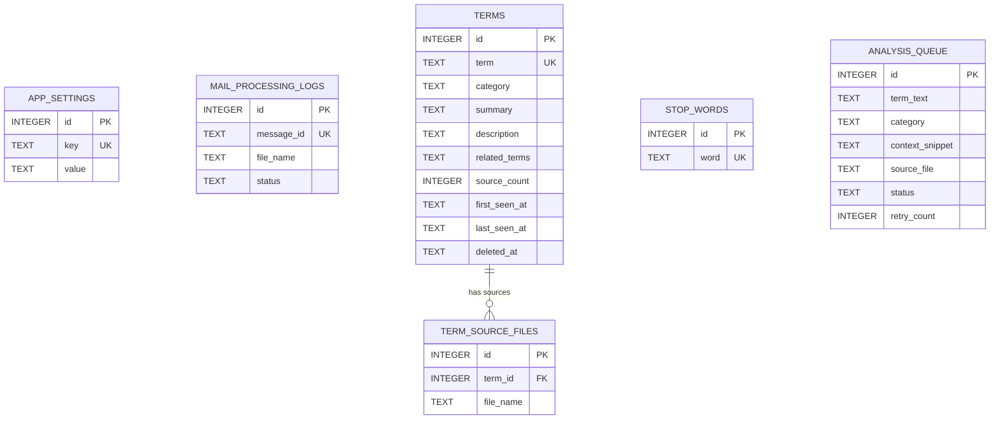

# 데이터 정의 목록

## 개요

본 문서는 메일 수신 용어 해설 업무 지원 도구의 데이터 모델을 정의합니다.

### 데이터 설계 원칙

- **로컬 파일 기반 저장**: POL-DATA 정책에 따라 SQLite를 기본 저장소로 사용한다 (JSON 파일 대안 가능).
- **정규화 수준**: 3NF를 기본으로 하되, 로컬 단일 사용자 앱 특성상 과도한 정규화를 지양한다.
- **무결성**: SQLite FK 제약, NOT NULL, UNIQUE 등을 적극 활용한다.
- **감사 추적**: 주요 엔티티에 `created_at`, `updated_at` 필드를 포함한다.
- **소프트 삭제**: 용어 사전 항목에만 적용하며, 나머지 엔티티는 물리 삭제를 기본으로 한다.

### 데이터베이스 기술 스택

| 항목 | 내용 |
|------|------|
| 기본 저장소 | SQLite 3 |
| 대안 저장소 | JSON 파일 (설정 데이터 등 일부) |
| 런타임 | .NET 10 (Microsoft.Data.Sqlite 또는 EF Core SQLite Provider) |
| 파일 저장소 | 로컬 파일 시스템 (분석 요청 텍스트 파일) |

### 공통 필드 규칙

모든 테이블에 아래 필드를 포함한다:

| 필드명 | 컬럼명 | 타입 | 설명 |
|--------|--------|------|------|
| id | id | INTEGER (PK, AUTOINCREMENT) | 기본 키 |
| createdAt | created_at | TEXT (ISO 8601) | 생성일시 |
| updatedAt | updated_at | TEXT (ISO 8601) | 수정일시 |

- SQLite는 날짜 전용 타입이 없으므로 ISO 8601 형식 문자열(`yyyy-MM-ddTHH:mm:ss.fffZ`)을 사용한다.
- `id`는 `INTEGER PRIMARY KEY AUTOINCREMENT`를 사용한다.

### 네이밍 컨벤션

| 대상 | 규칙 | 예시 |
|------|------|------|
| 논리명 (엔티티/필드) | PascalCase | Term, SourceCount |
| 물리명 (테이블/컬럼) | snake_case | terms, source_count |
| 인덱스 | idx_{테이블}_{컬럼} | idx_terms_term |
| 외래 키 | fk_{테이블}_{참조테이블} | fk_term_source_files_terms |

### 개인정보 처리 원칙

- 메일 발신자 이메일 주소(`from`)는 개인정보에 해당하며 필드에 표시한다.
- 메일 본문에 포함될 수 있는 환자 개인정보는 용어 해설 생성 시 사전 필터링한다 (POL-TERM 참조).
- 인증 정보(API 키, 시크릿)는 DB에 저장하지 않으며, 환경변수 또는 Windows Credential Manager로 관리한다 (POL-AUTH 참조).

## 진행 상태 범례

- ✅ 정의 완료
- 🔄 검토 중
- 📋 정의 예정
- ⏸️ 보류

## 데이터(엔티티) 목록

| 코드 | 엔티티명 | 테이블명 | 설명 | 상태 |
|------|----------|----------|------|------|
| DATA-001 | AppSettings | app_settings | 애플리케이션 환경설정 | ✅ |
| DATA-002 | MailProcessingLog | mail_processing_logs | 처리 완료된 메일 기록 (중복 방지) | ✅ |
| DATA-003 | Term | terms | 용어 사전 항목 | ✅ |
| DATA-004 | TermSourceFile | term_source_files | 용어 출처 파일 목록 | ✅ |
| DATA-005 | StopWord | stop_words | 불용어 목록 | ✅ |
| DATA-006 | AnalysisQueue | analysis_queue | 분석 대기/재시도 큐 | ✅ |

## ERD 요약

## 공통 규격

### 공통 필드

모든 테이블에 포함되는 필드:

| 필드 | 타입 | 필수 | 기본값 | 설명 |
|------|------|------|--------|------|
| id | INTEGER | ✅ | AUTOINCREMENT | 기본 키 |
| created_at | TEXT | ✅ | datetime('now') | 생성일시 (ISO 8601) |
| updated_at | TEXT | ✅ | datetime('now') | 수정일시 (ISO 8601) |

### 소프트 삭제 정책

- **적용 대상**: `terms` 테이블만 소프트 삭제를 적용한다.
- **방식**: `deleted_at` 컬럼이 NULL이 아닌 경우 삭제된 것으로 간주한다.
- **이유**: 용어 사전은 누적 데이터로서 복구 가능성을 보장해야 하며, 백업 정책(POL-DATA DATA-05)과 연계된다.
- **나머지 테이블**: 물리 삭제(DELETE)를 사용한다.

### 개인정보 필드 분류

| 테이블 | 필드 | 개인정보 유형 | 처리 방식 |
|--------|------|-------------|-----------|
| mail_processing_logs | from_address | 이메일 주소 | 분석 완료 후 원본 파일에만 보존, DB에는 저장하지 않음 |

- 메일 본문은 DB에 저장하지 않고, 로컬 텍스트 파일로만 관리한다 (POL-DATA DATA-03).
- 인증 정보는 DB에 저장하지 않는다 (POL-AUTH AUTH-02).
