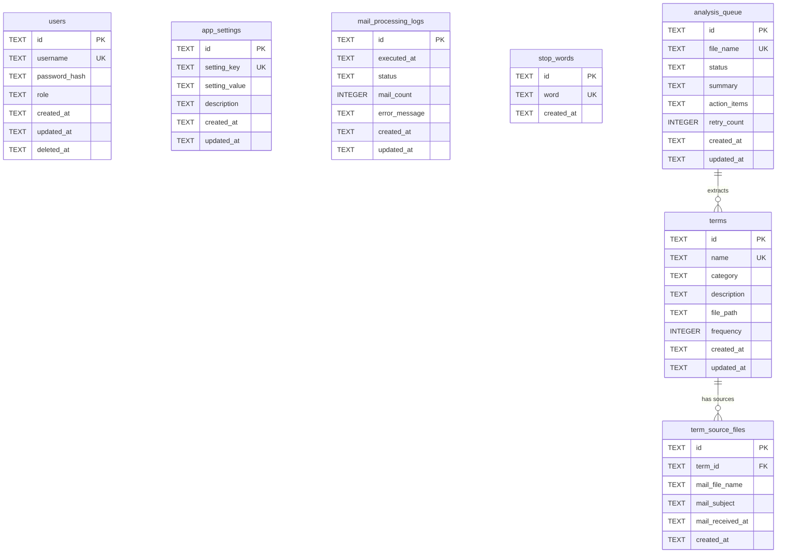

# 데이터 정의 목록

## 개요

### 데이터 설계 원칙 및 기본 규칙
- 메일 수신 용어 해설 업무 지원 웹 서비스의 데이터 모델을 정의한다.
- 도메인 주도 설계(DDD) 관점에서 핵심 엔티티와 값 객체를 분류하고, 3NF를 기본 정규화 수준으로 적용한다.
- 모든 엔티티는 감사 추적을 위한 공통 필드(`created_at`, `updated_at`)를 포함한다.
- 소프트 삭제가 필요한 엔티티에는 `deleted_at` 컬럼을 추가한다.

### 데이터베이스 기술 스택
- **DB 엔진**: SQLite (better-sqlite3 드라이버, 동기식 접근)
- **ORM**: Drizzle ORM (스키마 정의, 마이그레이션, 쿼리)
- **DB 파일 경로**: 환경변수 `DATABASE_PATH` (기본값: `./data/app.db`)
- **전문 검색**: SQLite FTS5 (용어 검색용)
- **관련 정책**: POL-DATA (DATA-R-001 ~ DATA-R-004)

### 파일 시스템 저장소
| 저장소 | 환경변수 | 기본 경로 | 용도 |
|--------|----------|-----------|------|
| 메일 임시 파일 | MAIL_STORAGE_PATH | `./data/mails` | 수신 메일 텍스트 임시 저장 (POL-DATA DATA-R-005) |
| 용어 해설집 | GLOSSARY_STORAGE_PATH | `./data/terms` | `<용어>.md` 파일 영구 저장 (POL-DATA DATA-R-006) |

### 공통 필드 규칙
모든 엔티티에 적용되는 공통 필드:

| 필드명 | 컬럼명 | 타입 | NOT NULL | 기본값 | 설명 |
|--------|--------|------|----------|--------|------|
| id | id | TEXT (UUID) | YES | - | 기본 키, `crypto.randomUUID()` 생성 |
| createdAt | created_at | TEXT (ISO 8601) | YES | `datetime('now')` | 레코드 생성 일시 |
| updatedAt | updated_at | TEXT (ISO 8601) | YES | `datetime('now')` | 레코드 최종 수정 일시 |

> SQLite는 네이티브 UUID/TIMESTAMP 타입이 없으므로 TEXT 타입에 ISO 8601 문자열로 저장한다.

### 네이밍 컨벤션
| 구분 | 규칙 | 예시 |
|------|------|------|
| 논리명 (코드) | camelCase | `emailSubject`, `retryCount` |
| 물리명 (컬럼) | snake_case | `email_subject`, `retry_count` |
| 테이블명 | snake_case, 복수형 | `users`, `terms`, `mail_processing_logs` |
| 인덱스명 | `idx_{테이블}_{컬럼}` | `idx_users_username` |
| 외래 키 컬럼 | `{참조테이블 단수}_id` | `term_id`, `user_id` |
| Boolean 컬럼 | `is_` 접두사 | `is_active`, `is_analyzed` |

### 개인정보 처리 원칙
- 개인정보/민감정보 필드는 필드 정의에서 :lock: 표시로 식별한다.
- 비밀번호는 bcrypt 해싱 후 저장 (POL-AUTH AUTH-R-007)
- IMAP 비밀번호, Claude API 키는 DB에 저장하지 않고 `.env.local`에서만 관리 (POL-AUTH AUTH-R-017, AUTH-R-018)
- 환경설정 조회 시 민감정보는 마스킹 처리 (POL-AUTH AUTH-R-020)

### 소프트 삭제 정책
- 사용자 계정(`users`): 소프트 삭제 적용 (`deleted_at` 컬럼) - POL-DATA DATA-R-015
- 용어(`terms`): 영구 보존, 삭제 없음 - POL-DATA DATA-R-017
- 메일 처리 로그(`mail_processing_logs`): 90일 경과 시 하드 삭제 - POL-DATA DATA-R-016

## 진행 상태 범례
- ✅ 정의 완료
- :repeat: 검토 중
- :clipboard: 정의 예정
- :pause_button: 보류

## 데이터(엔티티) 목록

| 코드 | 엔티티명 | 테이블명 | 설명 | 도메인 | 상태 |
|------|----------|----------|------|--------|------|
| DATA-001 | User | users | 서비스 이용 사용자 계정 (관리자/일반) | 인증 | ✅ |
| DATA-002 | AppSetting | app_settings | 시스템 환경설정 (IMAP 설정 등) | 설정 | ✅ |
| DATA-003 | MailProcessingLog | mail_processing_logs | 메일 수신/분석 처리 이력 | 메일 | ✅ |
| DATA-004 | Term | terms | 추출된 용어 및 해설 | 용어 | ✅ |
| DATA-005 | TermSourceFile | term_source_files | 용어가 추출된 메일 출처 파일 | 용어 | ✅ |
| DATA-006 | StopWord | stop_words | 용어 추출 시 제외할 불용어 | 용어 | ✅ |
| DATA-007 | AnalysisQueue | analysis_queue | 메일 파일 분석 대기열 | 분석 | ✅ |

## ERD 요약

## 공통 규격

### Drizzle ORM 스키마 정의 위치
- 스키마 파일: `src/db/schema.ts` (또는 `src/db/schema/` 디렉터리 분할)
- 마이그레이션: `drizzle/` 디렉터리 (Drizzle Kit 자동 생성)
- DB 연결: `src/db/index.ts`

### SQLite 제약사항 참고
- SQLite는 `ALTER TABLE`에 제한이 있으므로, 마이그레이션 시 테이블 재생성이 필요할 수 있다.
- Boolean 값은 INTEGER (0/1)로 저장한다.
- 날짜/시간은 TEXT (ISO 8601)로 저장한다.
- UUID는 TEXT 타입으로 저장한다.
- JSON 데이터는 TEXT 타입에 JSON 문자열로 저장한다.
