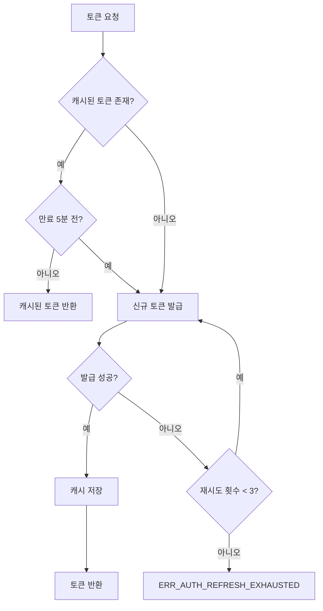

# Graph API 토큰 관리 기능 정의

## 개요

- **기능 목적**: Microsoft Graph API 및 Claude API에 대한 OAuth 2.0 Access Token 발급, 캐싱, 자동 갱신을 관리한다.
- **적용 범위**: 메일 수신(MAIL-RECV-001), 메일 상태 갱신(MAIL-PROC-002), 해설 생성(TERM-GEN-001) 등 외부 API를 호출하는 모든 기능에서 사용한다.

---

## CMN-AUTH-001: Graph API 토큰 관리

### 기본 정보

| 항목 | 내용 |
|------|------|
| 기능명 | Graph API 토큰 관리 |
| 분류 | 공통 기능 |
| 레이어 | Infrastructure |
| 트리거 | 외부 API 호출 직전, 토큰 만료 임박 시 |
| 관련 정책 | POL-AUTH (AUTH-01, AUTH-03, AUTH-04) |

### 입력 / 출력

#### 입력 (Input)

| 파라미터 | 타입 | 필수 | 설명 | 유효성 규칙 |
|----------|------|------|------|-------------|
| providerType | enum | ✅ | 인증 대상 (Graph / Claude) | Graph, Claude 중 하나 |
| tenantId | string | Graph 시 ✅ | Azure AD 테넌트 ID | GUID 형식 |
| clientId | string | Graph 시 ✅ | Azure AD 애플리케이션 ID | GUID 형식 |
| clientSecret | string | Graph 시 ✅ | 클라이언트 시크릿 | 비어 있지 않은 문자열 |
| apiKey | string | Claude 시 ✅ | Anthropic API 키 | `sk-ant-` 접두사 |

#### 출력 (Output)

| 항목 | 타입 | 설명 |
|------|------|------|
| accessToken | string | 유효한 Access Token |
| expiresAt | DateTime | 토큰 만료 시각 |
| isRefreshed | boolean | 이번 호출에서 갱신이 발생했는지 여부 |

#### 예외 / 오류

| 조건 | 오류 코드 | 설명 |
|------|-----------|------|
| 인증 정보 누락 | ERR_AUTH_MISSING_CREDENTIALS | 필수 인증 파라미터 없음 |
| 토큰 발급 실패 | ERR_AUTH_TOKEN_FAILED | OAuth 엔드포인트 응답 오류 |
| 갱신 재시도 초과 | ERR_AUTH_REFRESH_EXHAUSTED | 최대 3회 재시도 후에도 갱신 실패 |
| 잘못된 인증 정보 | ERR_AUTH_INVALID_CREDENTIALS | 401/403 응답 수신 |

### 처리 흐름

1. **캐시 확인**: 해당 providerType에 대한 캐시된 토큰이 있는지 확인한다.
2. **만료 판정**: 캐시된 토큰이 있으면 만료 5분 전인지 판정한다 (AUTH-03).
3. **토큰 유효 시**: 캐시된 토큰을 그대로 반환한다.
4. **토큰 갱신/발급**: 만료 임박 또는 캐시 없는 경우 신규 토큰을 발급받는다.
   - **Graph**: `https://login.microsoftonline.com/{tenantId}/oauth2/v2.0/token` 엔드포인트에 Client Credentials Flow로 요청
   - **Claude**: API 키를 `x-api-key` 헤더로 설정 (토큰 발급 불필요, 유효성만 확인)
5. **재시도**: 발급 실패 시 최대 3회 재시도한다 (CMN-HTTP-001 활용).
   - Graph: 동일 간격 재시도
   - Claude: 지수 백오프 (1초/2초/4초) (AUTH-04)
6. **캐시 저장**: 발급 성공 시 토큰과 만료 시각을 메모리에 캐싱한다.
7. **결과 반환**: 유효한 토큰 정보를 반환한다.

### 구현 가이드

- **패턴**: 토큰 캐시를 관리하는 Singleton 패턴 적용. 인증 제공자별로 Strategy 패턴으로 분리.
- **동시성**: 여러 스레드에서 동시에 토큰을 요청할 수 있으므로 SemaphoreSlim 등으로 토큰 갱신 중복 방지.
- **보안**: 토큰을 로그에 출력하지 않는다 (CMN-LOG-001 마스킹). 사용 후 참조 해제 (AUTH 제약사항).
- **외부 의존성**: HTTP 클라이언트 (CMN-HTTP-001 재시도 정책 적용), 암호화 저장소 (CMN-SEC-001에서 인증 정보 조회).

### 관련 기능

- **이 기능을 호출하는 기능**: MAIL-RECV-001, MAIL-PROC-002, TERM-GEN-001
- **이 기능이 호출하는 기능**: CMN-SEC-001 (인증 정보 조회), CMN-HTTP-001 (재시도 처리), CMN-LOG-001 (로깅)

### 테스트 시나리오

| 시나리오 | 입력 조건 | 기대 결과 |
|----------|-----------|-----------|
| 캐시 히트 | 유효한 캐시 토큰 존재, 만료까지 10분 | 캐시된 토큰 반환, isRefreshed=false |
| 자동 갱신 | 캐시 토큰 만료 4분 전 | 신규 토큰 발급 후 반환, isRefreshed=true |
| 캐시 미스 | 캐시 없음, 유효한 인증 정보 | 신규 토큰 발급 후 캐시 저장 |
| 인증 정보 누락 | clientSecret 비어 있음 | ERR_AUTH_MISSING_CREDENTIALS |
| 재시도 성공 | 첫 번째 실패, 두 번째 성공 | 두 번째 시도에서 토큰 반환 |
| 재시도 소진 | 3회 연속 실패 | ERR_AUTH_REFRESH_EXHAUSTED |
| 동시 갱신 | 2개 스레드가 동시에 갱신 요청 | 1회만 발급, 두 스레드 모두 동일 토큰 수신 |
| Claude API 키 검증 | 유효한 API 키 | 키 설정 완료, 토큰 캐시에 저장 |
