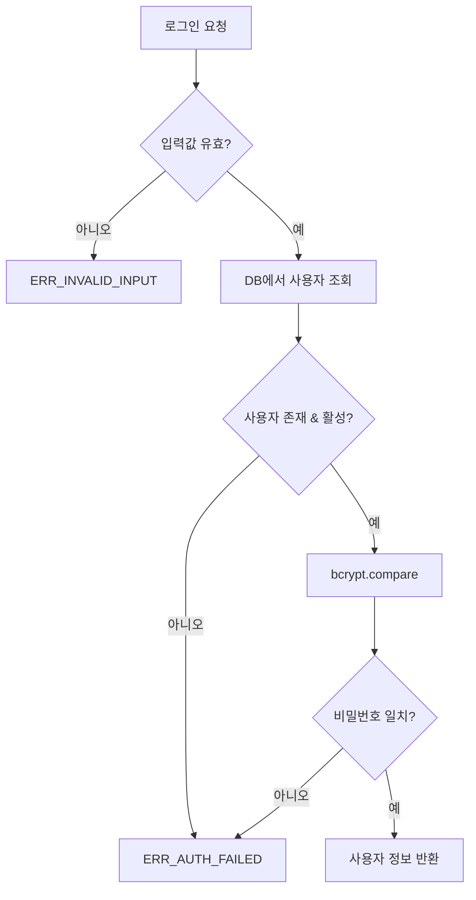

# 웹 로그인 인증 기능 정의

## 개요
- 아이디/비밀번호 기반 웹 로그인 인증 및 사용자 계정 관리 기능을 정의한다.
- 적용 범위: 로그인 API, 사용자 관리 API, 서버 초기화 시 관리자 계정 생성

---

## CMN-AUTH-001 웹 로그인 인증

### 기본 정보
| 항목 | 내용 |
|------|------|
| 기능명 | 웹 로그인 인증 |
| 분류 | 공통 기능 |
| 레이어 | lib/auth |
| 트리거 | 로그인 API 호출, 사용자 등록 API 호출, 서버 시작 시 |
| 관련 정책 | POL-AUTH (AUTH-R-001 ~ AUTH-R-016) |

### 입력 / 출력

#### 1. 로그인 인증 (authenticateUser)

##### 입력 (Input)
| 파라미터 | 타입 | 필수 | 설명 | 유효성 규칙 |
|----------|------|------|------|-------------|
| username | string | ✅ | 로그인 아이디 | 4~20자, 영문 소문자/숫자/_ |
| password | string | ✅ | 비밀번호 (평문) | 8자 이상 |

##### 출력 (Output)
| 항목 | 타입 | 설명 |
|------|------|------|
| user | { id, username, role } | null | 인증 성공 시 사용자 정보, 실패 시 null |

##### 예외 / 오류
| 조건 | 오류 코드 | 설명 |
|------|-----------|------|
| 아이디/비밀번호 불일치 | ERR_AUTH_FAILED | "아이디 또는 비밀번호가 일치하지 않습니다" (AUTH-R-011) |
| 비활성 계정 | ERR_AUTH_INACTIVE | 소프트 삭제 또는 비활성 계정 |
| 입력값 누락 | ERR_INVALID_INPUT | 필수 파라미터 없음 |

#### 2. 사용자 등록 (createUser)

##### 입력 (Input)
| 파라미터 | 타입 | 필수 | 설명 | 유효성 규칙 |
|----------|------|------|------|-------------|
| username | string | ✅ | 아이디 | 4~20자, /^[a-z0-9_]+$/ (AUTH-R-003) |
| password | string | ✅ | 비밀번호 | 8자 이상, 영문+숫자+특수문자 각 1자 이상 (AUTH-R-005, AUTH-R-006) |
| role | string | ✅ | 역할 | "admin" 또는 "user" |
| requestorRole | string | ✅ | 요청자 역할 | "admin" 필수 (AUTH-R-002) |

##### 출력 (Output)
| 항목 | 타입 | 설명 |
|------|------|------|
| user | { id, username, role } | 생성된 사용자 정보 |

##### 예외 / 오류
| 조건 | 오류 코드 | 설명 |
|------|-----------|------|
| 권한 없음 | ERR_FORBIDDEN | 관리자만 등록 가능 (AUTH-R-002) |
| 아이디 중복 | ERR_DUPLICATE_USERNAME | 이미 존재하는 아이디 (AUTH-R-004) |
| 아이디 형식 오류 | ERR_INVALID_USERNAME | 형식 불일치 (AUTH-R-003) |
| 비밀번호 정책 위반 | ERR_WEAK_PASSWORD | 비밀번호 규칙 미충족 (AUTH-R-005, AUTH-R-006) |

#### 3. 초기 관리자 생성 (ensureAdminUser)

##### 입력 (Input)
| 파라미터 | 타입 | 필수 | 설명 | 유효성 규칙 |
|----------|------|------|------|-------------|
| - | - | - | 환경변수 ADMIN_USERNAME, ADMIN_PASSWORD에서 읽음 | AUTH-R-001 |

##### 출력 (Output)
| 항목 | 타입 | 설명 |
|------|------|------|
| created | boolean | 관리자 계정 생성 여부 (이미 존재하면 false) |

### 처리 흐름

#### 로그인 인증 흐름

1. **입력 유효성 검사**: username, password 존재 및 형식 확인
2. **사용자 조회**: DB에서 username으로 사용자 조회 (deleted_at IS NULL, is_active = 1)
3. **비밀번호 검증**: bcrypt.compare()로 입력 비밀번호와 저장된 해시 비교
4. **결과 반환**: 성공 시 사용자 정보 반환, 실패 시 통합 오류 메시지 (AUTH-R-011)

#### 사용자 등록 흐름

1. **권한 확인**: 요청자가 admin인지 확인 (AUTH-R-002)
2. **입력 유효성 검사**: username 형식 (AUTH-R-003), password 정책 (AUTH-R-005, AUTH-R-006)
3. **중복 확인**: username 유니크 검사 (AUTH-R-004)
4. **비밀번호 해싱**: bcrypt.hash(password, 10) (AUTH-R-007)
5. **DB 저장**: users 테이블에 INSERT
6. **결과 반환**: 생성된 사용자 정보 (비밀번호 제외)

### 구현 가이드

- **패턴**: Service 패턴 - lib/auth/auth-service.ts에 함수로 구현
- **비밀번호 해싱**: bcrypt 라이브러리, salt rounds 10 (AUTH-R-007)
- **동시성**: 사용자 등록 시 username UNIQUE 제약으로 DB 레벨에서 중복 방지
- **보안**:
  - 로그인 실패 시 아이디/비밀번호 구분 없이 통합 메시지 반환 (AUTH-R-011)
  - 비밀번호는 해시만 저장, 평문 저장 금지 (AUTH-R-007)
  - 소프트 삭제된 계정은 로그인 불가
- **외부 의존성**: bcrypt (비밀번호 해싱), Drizzle ORM (DB 접근)

### 관련 기능
- **이 기능을 호출하는 기능**: API Route Handler (POST /api/auth/login, POST /api/users)
- **이 기능이 호출하는 기능**: CMN-SESSION-001 (로그인 성공 후 세션 생성)

### 관련 데이터
- DATA-001 User (users 테이블)

### 테스트 시나리오

| 시나리오 | 입력 조건 | 기대 결과 |
|----------|-----------|-----------|
| 정상 로그인 | 유효한 아이디/비밀번호 | 사용자 정보 반환 |
| 잘못된 비밀번호 | 존재하는 아이디, 틀린 비밀번호 | ERR_AUTH_FAILED |
| 존재하지 않는 아이디 | 미등록 아이디 | ERR_AUTH_FAILED (동일 메시지) |
| 비활성 계정 로그인 | deleted_at 설정된 계정 | ERR_AUTH_INACTIVE |
| 사용자 등록 - 정상 | 관리자 권한, 유효한 입력 | 사용자 생성 성공 |
| 사용자 등록 - 권한 없음 | 일반 사용자 권한 | ERR_FORBIDDEN |
| 사용자 등록 - 아이디 중복 | 이미 존재하는 username | ERR_DUPLICATE_USERNAME |
| 사용자 등록 - 약한 비밀번호 | "12345678" (특수문자 없음) | ERR_WEAK_PASSWORD |
| 초기 관리자 생성 | 환경변수 설정됨, DB에 관리자 없음 | 관리자 계정 생성 |
| 초기 관리자 중복 | DB에 관리자 이미 존재 | 생성 건너뜀 (created=false) |
