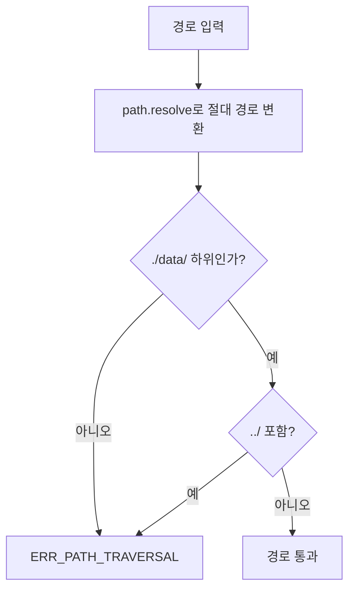

# 파일 시스템 관리 기능 정의

## 개요
- 파일 읽기/쓰기/삭제, 디렉터리 보장, 경로 보안 검증 기능을 정의한다.
- 적용 범위: 메일 임시 파일 관리, 용어 해설집 파일 관리, 모든 파일 I/O 작업

---

## CMN-FS-001 파일 시스템 관리

### 기본 정보
| 항목 | 내용 |
|------|------|
| 기능명 | 파일 시스템 관리 |
| 분류 | 공통 기능 |
| 레이어 | lib/fs |
| 트리거 | 메일 저장, 용어 해설집 생성/갱신, 파일 삭제 |
| 관련 정책 | POL-DATA (DATA-R-005 ~ DATA-R-014) |

### 입력 / 출력

#### 1. 파일 쓰기 (writeFile)

##### 입력 (Input)
| 파라미터 | 타입 | 필수 | 설명 | 유효성 규칙 |
|----------|------|------|------|-------------|
| basePath | string | ✅ | 기준 디렉터리 경로 | ./data/ 하위 필수 (DATA-R-007) |
| fileName | string | ✅ | 파일명 | 사용 불가 문자 자동 치환 (DATA-R-012) |
| content | string | ✅ | 파일 내용 | - |

##### 출력 (Output)
| 항목 | 타입 | 설명 |
|------|------|------|
| filePath | string | 저장된 파일의 절대 경로 |

#### 2. 파일 읽기 (readFile)

##### 입력 (Input)
| 파라미터 | 타입 | 필수 | 설명 | 유효성 규칙 |
|----------|------|------|------|-------------|
| filePath | string | ✅ | 파일 경로 | ./data/ 하위 필수 |

##### 출력 (Output)
| 항목 | 타입 | 설명 |
|------|------|------|
| content | string | null | 파일 내용, 없으면 null |

#### 3. 파일 삭제 (deleteFile)

##### 입력 (Input)
| 파라미터 | 타입 | 필수 | 설명 | 유효성 규칙 |
|----------|------|------|------|-------------|
| filePath | string | ✅ | 파일 경로 | ./data/ 하위 필수 |

##### 출력 (Output)
| 항목 | 타입 | 설명 |
|------|------|------|
| deleted | boolean | 삭제 성공 여부 |

#### 4. 디렉터리 보장 (ensureDirectory)

##### 입력 (Input)
| 파라미터 | 타입 | 필수 | 설명 | 유효성 규칙 |
|----------|------|------|------|-------------|
| dirPath | string | ✅ | 디렉터리 경로 | ./data/ 하위 필수 |

##### 출력 (Output)
| 항목 | 타입 | 설명 |
|------|------|------|
| - | void | 디렉터리 존재 보장 (mkdir -p 동작) |

#### 5. 파일 목록 조회 (listFiles)

##### 입력 (Input)
| 파라미터 | 타입 | 필수 | 설명 | 유효성 규칙 |
|----------|------|------|------|-------------|
| dirPath | string | ✅ | 디렉터리 경로 | ./data/ 하위 필수 |
| pattern | string | ❌ | 파일명 필터 (glob 패턴) | 예: "*.txt" |

##### 출력 (Output)
| 항목 | 타입 | 설명 |
|------|------|------|
| files | FileInfo[] | 파일명, 크기, 수정일시 목록 |

#### 6. 파일명 정규화 (sanitizeFileName)

##### 입력 (Input)
| 파라미터 | 타입 | 필수 | 설명 | 유효성 규칙 |
|----------|------|------|------|-------------|
| name | string | ✅ | 원본 파일명 | - |

##### 출력 (Output)
| 항목 | 타입 | 설명 |
|------|------|------|
| sanitized | string | 사용 불가 문자가 _로 치환된 파일명 (DATA-R-012) |

##### 예외 / 오류
| 조건 | 오류 코드 | 설명 |
|------|-----------|------|
| 경로 탈출 시도 | ERR_PATH_TRAVERSAL | ./data/ 외부 접근 시도 (DATA-R-007) |
| 파일 쓰기 실패 | ERR_FILE_WRITE | 디스크 공간 부족 등 |
| 파일 읽기 실패 | ERR_FILE_NOT_FOUND | 파일 미존재 |

### 처리 흐름

#### 경로 보안 검증

### 파일명 치환 규칙 (DATA-R-012)
치환 대상 문자: `/`, `\`, `:`, `*`, `?`, `"`, `<`, `>`, `|`
치환 문자: `_`

### 구현 가이드

- **패턴**: 유틸리티 함수 모듈 - lib/fs/file-service.ts
- **동시성**: 동일 파일에 대한 동시 쓰기 시 마지막 쓰기가 이김 (last-write-wins). 중요 파일은 호출자가 직렬화해야 함
- **보안**:
  - 모든 파일 경로에 path.resolve() 후 ./data/ 하위 여부 검증 (DATA-R-007)
  - path traversal (../) 차단
- **외부 의존성**: Node.js fs/promises, path 모듈

### 관련 기능
- **이 기능을 호출하는 기능**: DATA-FILE-001, DATA-FILE-002, DATA-DICT-001, DATA-DICT-002, MAIL-PROC-001
- **이 기능이 호출하는 기능**: CMN-LOG-001 (오류 로깅)

### 테스트 시나리오

| 시나리오 | 입력 조건 | 기대 결과 |
|----------|-----------|-----------|
| 정상 파일 쓰기 | basePath="./data/mails", content="test" | 파일 생성 성공 |
| 디렉터리 자동 생성 | 존재하지 않는 디렉터리 | 디렉터리 생성 후 파일 쓰기 |
| 경로 탈출 차단 | filePath="../../etc/passwd" | ERR_PATH_TRAVERSAL |
| 파일명 정규화 | name="EMR:시스템/관리" | "EMR_시스템_관리" |
| 파일 목록 조회 | dirPath="./data/mails", pattern="*.txt" | txt 파일 목록 |
| 존재하지 않는 파일 읽기 | 미존재 경로 | null 반환 |
