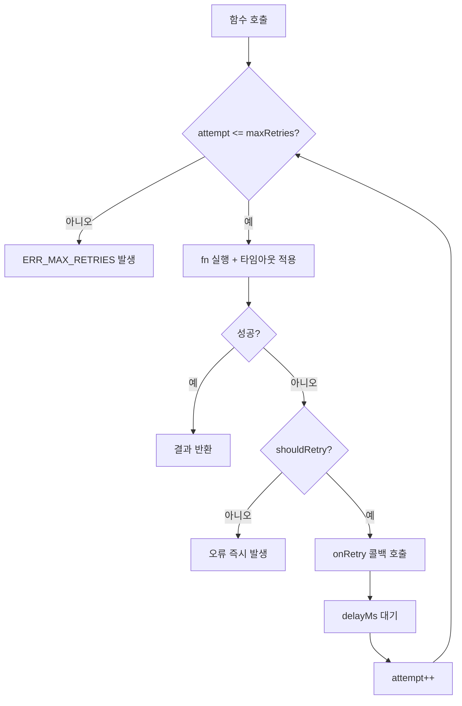

# HTTP 재시도 기능 정의

## 개요
- 외부 API/서비스 호출 시 일시적 오류에 대한 재시도 로직을 정의한다.
- 적용 범위: Claude API 호출, IMAP 연결 등 외부 서비스 통신

---

## CMN-HTTP-001 HTTP 재시도

### 기본 정보
| 항목 | 내용 |
|------|------|
| 기능명 | HTTP 재시도 |
| 분류 | 공통 기능 |
| 레이어 | lib/http |
| 트리거 | 외부 서비스 호출 실패 시 |
| 관련 정책 | POL-MAIL (MAIL-R-003), POL-TERM (TERM-R-007, TERM-R-008) |

### 입력 / 출력

#### withRetry (범용 재시도 래퍼)

##### 입력 (Input)
| 파라미터 | 타입 | 필수 | 설명 | 유효성 규칙 |
|----------|------|------|------|-------------|
| fn | () => Promise<T> | ✅ | 실행할 비동기 함수 | - |
| options.maxRetries | number | ❌ | 최대 재시도 횟수 | 기본값 3 |
| options.delayMs | number | ❌ | 재시도 간격 (ms) | 기본값 5000 |
| options.timeoutMs | number | ❌ | 단일 호출 타임아웃 (ms) | 기본값 60000 |
| options.shouldRetry | (error) => boolean | ❌ | 재시도 조건 판단 함수 | - |
| options.onRetry | (attempt, error) => void | ❌ | 재시도 시 콜백 (로깅용) | - |

##### 출력 (Output)
| 항목 | 타입 | 설명 |
|------|------|------|
| result | T | 성공 시 함수 반환값 |

##### 예외 / 오류
| 조건 | 오류 코드 | 설명 |
|------|-----------|------|
| 모든 재시도 소진 | ERR_MAX_RETRIES | 최대 재시도 후에도 실패 |
| 타임아웃 | ERR_TIMEOUT | 단일 호출 타임아웃 초과 |

### 처리 흐름

### 사전 정의 프리셋

| 프리셋 | maxRetries | delayMs | timeoutMs | 용도 |
|--------|-----------|---------|-----------|------|
| IMAP 연결 | 3 | 10000 | 30000 | MAIL-R-003 |
| Claude API 호출 | 2 | 5000 | 60000 | TERM-R-007, TERM-R-008 |

### 구현 가이드

- **패턴**: Higher-Order Function (함수 래퍼)
- **동시성**: 호출자 단위로 독립 실행, 공유 상태 없음
- **성능**: 불필요한 재시도 방지를 위해 shouldRetry로 4xx 오류는 재시도하지 않음
- **외부 의존성**: 없음 (순수 유틸리티)

### 관련 기능
- **이 기능을 호출하는 기능**: MAIL-RECV-001 (IMAP 연결), TERM-GEN-001 (Claude API 호출)
- **이 기능이 호출하는 기능**: CMN-LOG-001 (재시도 로깅)

### 테스트 시나리오

| 시나리오 | 입력 조건 | 기대 결과 |
|----------|-----------|-----------|
| 첫 시도 성공 | fn이 즉시 성공 | 결과 반환, 재시도 없음 |
| 2회차 성공 | 1회 실패 후 2회 성공 | 결과 반환 |
| 모든 재시도 실패 | maxRetries회 모두 실패 | ERR_MAX_RETRIES |
| 타임아웃 | fn이 timeoutMs 초과 | ERR_TIMEOUT 후 재시도 |
| 재시도 불가 오류 | shouldRetry가 false 반환 | 즉시 오류 발생 |
