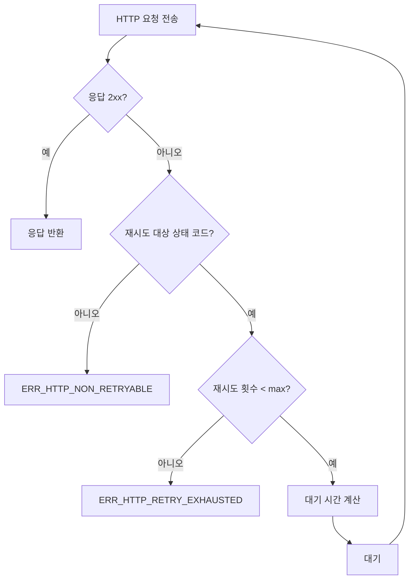

# HTTP 재시도 처리 기능 정의

## 개요

- **기능 목적**: 외부 API 호출 시 일시적 실패에 대한 재시도 전략(지수 백오프, Rate Limit 대응)을 공통으로 제공한다.
- **적용 범위**: Graph API 호출(CMN-AUTH-001, MAIL-RECV-001), Claude API 호출(TERM-GEN-001) 등 모든 HTTP 기반 외부 통신에 적용한다.

---

## CMN-HTTP-001: HTTP 재시도 처리

### 기본 정보

| 항목 | 내용 |
|------|------|
| 기능명 | HTTP 재시도 처리 |
| 분류 | 공통 기능 |
| 레이어 | Infrastructure |
| 트리거 | HTTP 요청 실패 시 |
| 관련 정책 | POL-AUTH (AUTH-04), POL-MAIL (MAIL-06) |

### 입력 / 출력

#### 입력 (Input)

| 파라미터 | 타입 | 필수 | 설명 | 유효성 규칙 |
|----------|------|------|------|-------------|
| request | HttpRequestMessage | ✅ | 실행할 HTTP 요청 | |
| retryPolicy | RetryPolicy | ✅ | 재시도 정책 설정 | |

**RetryPolicy 구조**

| 필드 | 타입 | 설명 | 기본값 |
|------|------|------|--------|
| maxRetries | int | 최대 재시도 횟수 | 3 |
| backoffType | enum | Fixed / Exponential | Exponential |
| baseDelayMs | int | 기본 대기 시간(ms) | 1000 |
| retryableStatusCodes | int[] | 재시도 대상 HTTP 상태 코드 | [429, 500, 502, 503, 504] |
| respectRetryAfter | boolean | Retry-After 헤더 준수 여부 | true |

#### 출력 (Output)

| 항목 | 타입 | 설명 |
|------|------|------|
| response | HttpResponseMessage | HTTP 응답 |
| attemptCount | int | 총 시도 횟수 |

#### 예외 / 오류

| 조건 | 오류 코드 | 설명 |
|------|-----------|------|
| 재시도 소진 | ERR_HTTP_RETRY_EXHAUSTED | 최대 재시도 후에도 실패 |
| 네트워크 오류 | ERR_HTTP_NETWORK | 네트워크 연결 불가 |
| 비재시도 오류 | ERR_HTTP_NON_RETRYABLE | 재시도 대상이 아닌 오류 (400, 404 등) |

### 처리 흐름

1. **요청 실행**: HTTP 요청을 전송한다.
2. **응답 확인**: 성공(2xx)이면 즉시 반환한다.
3. **재시도 판정**: 응답 상태 코드가 retryableStatusCodes에 포함되는지 확인한다.
   - 포함되지 않으면 비재시도 오류로 즉시 반환한다.
4. **대기 시간 계산**:
   - HTTP 429: `Retry-After` 헤더가 있으면 해당 값 사용 (MAIL-06)
   - Exponential: `baseDelayMs * 2^(attemptCount-1)` (AUTH-04: 1초/2초/4초)
   - Fixed: `baseDelayMs` 고정
5. **대기 후 재시도**: 계산된 시간만큼 대기 후 요청을 재전송한다.
6. **최대 횟수 초과**: maxRetries 초과 시 ERR_HTTP_RETRY_EXHAUSTED를 반환한다.

### 구현 가이드

- **패턴**: Decorator/DelegatingHandler 패턴으로 HttpClient 파이프라인에 통합.
- **동시성**: 각 요청은 독립적으로 재시도 카운트를 관리한다.
- **성능**: 대기 중 스레드를 점유하지 않도록 비동기(async/await) 방식으로 구현한다.
- **외부 의존성**: HttpClient (DI를 통한 HttpClientFactory 활용 권장)

### 관련 기능

- **이 기능을 호출하는 기능**: CMN-AUTH-001, MAIL-RECV-001, MAIL-PROC-002, TERM-GEN-001
- **이 기능이 호출하는 기능**: CMN-LOG-001 (재시도 로깅)

### 테스트 시나리오

| 시나리오 | 입력 조건 | 기대 결과 |
|----------|-----------|-----------|
| 즉시 성공 | 200 응답 | 응답 반환, attemptCount=1 |
| 1회 실패 후 성공 | 첫 요청 500, 두 번째 200 | 응답 반환, attemptCount=2 |
| 재시도 소진 | 3회 연속 500 | ERR_HTTP_RETRY_EXHAUSTED |
| Rate Limit 대응 | 429 + Retry-After: 5 | 5초 대기 후 재시도 |
| 지수 백오프 | Exponential, base=1000ms | 1초, 2초, 4초 간격 |
| 비재시도 오류 | 400 응답 | 즉시 ERR_HTTP_NON_RETRYABLE |
| 네트워크 오류 | 연결 불가 | ERR_HTTP_NETWORK |
