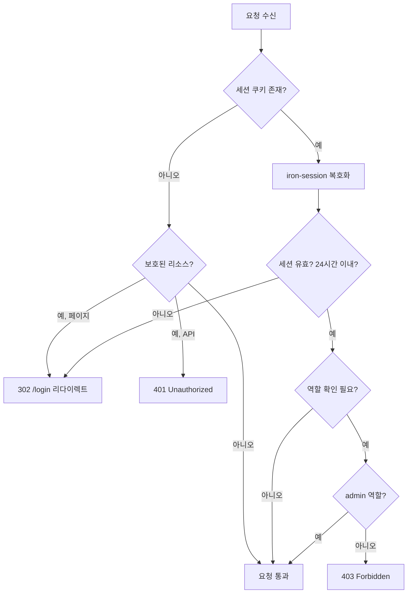

# 세션 관리 기능 정의

## 개요
- iron-session 기반 암호화 HTTP-only 쿠키 세션의 생성, 검증, 삭제 기능을 정의한다.
- Next.js App Router 미들웨어와 연동하여 인증 가드 역할을 수행한다.
- 적용 범위: 모든 인증 필요 페이지 및 API 라우트

---

## CMN-SESSION-001 세션 관리

### 기본 정보
| 항목 | 내용 |
|------|------|
| 기능명 | 세션 관리 |
| 분류 | 공통 기능 |
| 레이어 | lib/auth |
| 트리거 | 로그인 성공 시 (생성), 모든 인증 필요 요청 시 (검증), 로그아웃 시 (삭제) |
| 관련 정책 | POL-AUTH (AUTH-R-009, AUTH-R-010, AUTH-R-012, AUTH-R-013, AUTH-R-019) |

### 입력 / 출력

#### 1. 세션 생성 (createSession)

##### 입력 (Input)
| 파라미터 | 타입 | 필수 | 설명 | 유효성 규칙 |
|----------|------|------|------|-------------|
| userId | string | ✅ | 사용자 UUID | - |
| username | string | ✅ | 사용자 아이디 | - |
| role | string | ✅ | 사용자 역할 | "admin" 또는 "user" |

##### 출력 (Output)
| 항목 | 타입 | 설명 |
|------|------|------|
| - | void | 응답 쿠키에 암호화된 세션 설정 |

#### 2. 세션 검증 (getSession)

##### 입력 (Input)
| 파라미터 | 타입 | 필수 | 설명 | 유효성 규칙 |
|----------|------|------|------|-------------|
| - | - | - | 요청 쿠키에서 자동 추출 | - |

##### 출력 (Output)
| 항목 | 타입 | 설명 |
|------|------|------|
| session | { userId, username, role } | null | 유효한 세션이면 세션 데이터, 아니면 null |

#### 3. 세션 삭제 (destroySession)

##### 입력 (Input)
없음 (현재 요청의 세션 대상)

##### 출력 (Output)
| 항목 | 타입 | 설명 |
|------|------|------|
| - | void | 세션 쿠키 삭제 |

#### 4. 인증 가드 (requireAuth / requireAdmin)

##### 입력 (Input)
| 파라미터 | 타입 | 필수 | 설명 | 유효성 규칙 |
|----------|------|------|------|-------------|
| requiredRole | string | ❌ | 필요한 역할 | "admin" (선택) |

##### 출력 (Output)
| 항목 | 타입 | 설명 |
|------|------|------|
| session | { userId, username, role } | 인증 통과 시 세션 데이터 |

##### 예외 / 오류
| 조건 | 오류 코드 | 설명 |
|------|-----------|------|
| 세션 없음/만료 | ERR_UNAUTHORIZED | 401, 페이지는 /login 리다이렉트 (AUTH-R-012) |
| 권한 부족 | ERR_FORBIDDEN | 403, 관리자 전용 리소스 접근 (AUTH-R-014, AUTH-R-015) |

### 처리 흐름



### 세션 데이터 구조

```typescript
interface SessionData {
  userId: string;
  username: string;
  role: "admin" | "user";
}
```

### iron-session 설정

| 항목 | 값 | 관련 정책 |
|------|-----|-----------|
| cookieName | "mail-term-session" | - |
| password | 환경변수 SESSION_SECRET (32자 이상) | AUTH-R-019 |
| ttl | 86400 (24시간, 초 단위) | AUTH-R-010 |
| cookieOptions.httpOnly | true | AUTH-R-009 |
| cookieOptions.secure | process.env.NODE_ENV === "production" | AUTH-R-009 |
| cookieOptions.sameSite | "lax" | - |

### 구현 가이드

- **패턴**: iron-session의 getIronSession 래핑 함수
- **미들웨어**: Next.js middleware.ts에서 경로 패턴별 인증 검증
- **보안**:
  - SESSION_SECRET은 32자 이상 랜덤 문자열 (AUTH-R-019)
  - HTTP-only, Secure(프로덕션), SameSite 쿠키 (AUTH-R-009)
  - 세션 만료 시 자동 무효화 (AUTH-R-010)
- **예외 경로**: /login, /api/health는 인증 없이 접근 가능

### 관련 기능
- **이 기능을 호출하는 기능**: CMN-AUTH-001 (로그인 성공 후), 모든 API Route Handler
- **이 기능이 호출하는 기능**: 없음

### 테스트 시나리오

| 시나리오 | 입력 조건 | 기대 결과 |
|----------|-----------|-----------|
| 세션 생성 | 유효한 사용자 정보 | 암호화된 세션 쿠키 설정 |
| 유효한 세션 검증 | 24시간 이내 세션 쿠키 | 세션 데이터 반환 |
| 만료 세션 검증 | 24시간 초과 세션 쿠키 | null 반환 |
| 세션 없이 보호된 API 접근 | 쿠키 없음, /api/config 요청 | 401 Unauthorized |
| 세션 없이 보호된 페이지 접근 | 쿠키 없음, /dashboard 요청 | 302 /login 리다이렉트 |
| 일반 사용자로 관리자 API 접근 | role=user, /api/users 요청 | 403 Forbidden |
| /login 접근 | 세션 없음 | 정상 접근 |
| /api/health 접근 | 세션 없음 | 정상 접근 |
| 로그아웃 | 유효한 세션 | 세션 쿠키 삭제 |
