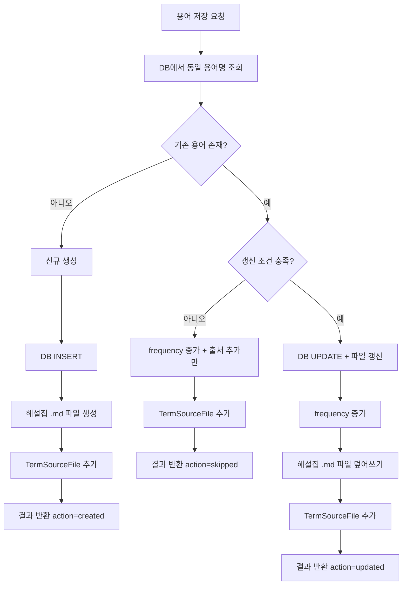

# 용어 사전 저장소 기능 정의

## 개요
- 용어-해설 쌍을 DB와 마크다운 파일에 이중 저장하고, 갱신 조건을 판단하며, FTS5 검색 인덱스를 동기화하는 기능을 정의한다.
- 적용 범위: 용어 분석 결과 저장, 용어사전 뷰어 데이터 제공

---

## DATA-DICT-001 용어 사전 저장소

### 기본 정보
| 항목 | 내용 |
|------|------|
| 기능명 | 용어 사전 저장소 |
| 분류 | 도메인 특화 로직 |
| 레이어 | lib/dictionary |
| 트리거 | TERM-GEN-001에서 해설 생성 완료 후 |
| 관련 정책 | POL-DATA (DATA-R-006, DATA-R-011 ~ DATA-R-014), POL-TERM (TERM-R-016 ~ TERM-R-019) |

### 입력 / 출력

#### 1. 용어 저장/갱신 (saveTerm)

##### 입력 (Input)
| 파라미터 | 타입 | 필수 | 설명 | 유효성 규칙 |
|----------|------|------|------|-------------|
| name | string | ✅ | 용어명 | 최대 200자 |
| category | string | ✅ | 분류 | "emr" / "business" / "abbreviation" / "general" |
| description | string | ✅ | 해설 | - |
| sourceMailSubject | string | ❌ | 출처 메일 제목 | - |
| sourceMailDate | string | ❌ | 출처 메일 수신일 | ISO 8601 |
| sourceMailFileName | string | ❌ | 출처 메일 파일명 | - |

##### 출력 (Output)
| 항목 | 타입 | 설명 |
|------|------|------|
| termId | string | 용어 레코드 ID |
| action | "created" / "updated" / "skipped" | 수행된 동작 |

#### 2. 용어 조회 (getTerm / getTermByName)

##### 입력 (Input)
| 파라미터 | 타입 | 필수 | 설명 | 유효성 규칙 |
|----------|------|------|------|-------------|
| id | string | ✅ (ID 조회) | 용어 UUID | - |
| name | string | ✅ (이름 조회) | 용어명 | - |

##### 출력 (Output)
| 항목 | 타입 | 설명 |
|------|------|------|
| term | Term | null | 용어 정보 (DATA-004 필드 전체) |

##### 예외 / 오류
| 조건 | 오류 코드 | 설명 |
|------|-----------|------|
| 파일 생성 실패 | ERR_DICT_FILE_WRITE | 해설집 파일 쓰기 실패 (DB는 성공했으나 파일 실패) |

### 처리 흐름

#### 용어 저장/갱신 흐름



### 갱신 조건 판단 (TERM-R-018)

기존 해설이 있는 경우, 다음 조건 중 하나 이상 충족 시 갱신:
1. 새 해설의 문자 수가 기존 대비 20% 이상 증가
2. 새 출처 메일 정보가 추가된 경우 (sourceMailFileName이 기존과 다른 경우)

### 해설집 파일 형식 (TERM-R-017, TERM-R-019)

```markdown
# {용어명}

## 해설
{용어 해설 내용}

## 분류
{emr / business / abbreviation / general}

## 메타정보
- 마지막 갱신: {YYYY-MM-DD HH:mm}
- 출처: {마지막 출처 메일 제목} ({수신일})
- 발견 빈도: {frequency}회
```

### 파일명 규칙
- `{용어명}.md` (GLOSSARY_STORAGE_PATH 하위)
- 파일명 불가 문자 치환: CMN-FS-001.sanitizeFileName 사용 (DATA-R-012)

### 구현 가이드

- **패턴**: Repository 패턴 - lib/dictionary/term-repository.ts
- **이중 저장**: DB INSERT/UPDATE + 파일 생성/덮어쓰기를 하나의 트랜잭션으로 처리
- **FTS5 동기화**: DB 트리거로 자동 동기화 (DDL에 정의됨)
- **동시성**: DB UNIQUE 제약으로 중복 방지, 파일 쓰기는 last-write-wins
- **외부 의존성**: Drizzle ORM, CMN-FS-001

### 관련 기능
- **이 기능을 호출하는 기능**: TERM-BATCH-001, VIEW-SEARCH-001, VIEW-TREND-001
- **이 기능이 호출하는 기능**: CMN-FS-001, CMN-LOG-001

### 관련 데이터
- DATA-004 Term (terms 테이블)
- DATA-005 TermSourceFile (term_source_files 테이블)
- 파일 시스템: GLOSSARY_STORAGE_PATH (`./data/terms`)

### 테스트 시나리오

| 시나리오 | 입력 조건 | 기대 결과 |
|----------|-----------|-----------|
| 신규 용어 저장 | 존재하지 않는 용어명 | DB INSERT + .md 파일 생성, action=created |
| 기존 용어 갱신 (해설 증가) | 기존 100자, 새 150자 (50% 증가) | DB UPDATE + 파일 덮어쓰기, action=updated |
| 기존 용어 스킵 | 기존 100자, 새 110자 (10% 증가, 동일 출처) | frequency만 증가, action=skipped |
| 파일명 특수문자 | 용어명="EMR:관리/시스템" | 파일명="EMR_관리_시스템.md" |
| 출처 추가 | 동일 용어, 다른 메일 파일 | TermSourceFile 추가, frequency 증가 |
| 영구 보존 확인 | 삭제 요청 | 삭제 기능 미제공 (DATA-R-014) |
