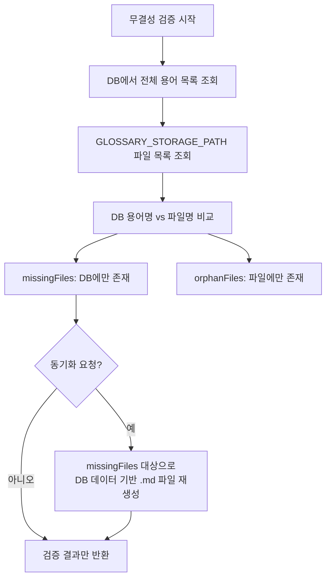

# 용어 사전 백업 기능 정의

## 개요
- 용어 해설집 파일의 무결성 검증 및 DB-파일 간 동기화 기능을 정의한다.
- 적용 범위: 서버 시작 시 또는 관리자 요청 시 실행

---

## DATA-DICT-002 용어 사전 백업

### 기본 정보
| 항목 | 내용 |
|------|------|
| 기능명 | 용어 사전 백업 |
| 분류 | 도메인 특화 로직 |
| 레이어 | lib/dictionary |
| 트리거 | 서버 시작 시 (선택적), 관리자 API 호출 시 |
| 관련 정책 | POL-DATA (DATA-R-006, DATA-R-011, DATA-R-014) |

### 입력 / 출력

#### 1. 무결성 검증 (verifyIntegrity)

##### 입력 (Input)
없음 (DB와 파일 시스템을 직접 비교)

##### 출력 (Output)
| 항목 | 타입 | 설명 |
|------|------|------|
| totalTerms | number | DB 용어 수 |
| totalFiles | number | 파일 시스템 용어 파일 수 |
| missingFiles | string[] | DB에 있지만 파일이 없는 용어명 |
| orphanFiles | string[] | 파일은 있지만 DB에 없는 파일명 |

#### 2. DB-파일 동기화 (syncToFiles)

##### 입력 (Input)
| 파라미터 | 타입 | 필수 | 설명 | 유효성 규칙 |
|----------|------|------|------|-------------|
| termNames | string[] | ❌ | 동기화 대상 용어명 (미지정 시 전체) | - |

##### 출력 (Output)
| 항목 | 타입 | 설명 |
|------|------|------|
| syncedCount | number | 동기화된 파일 수 |

### 처리 흐름

### 구현 가이드

- **패턴**: Service 함수 - lib/dictionary/dict-sync-service.ts
- **성능**: 전체 동기화는 용어 수에 비례하므로, 대량 데이터 시 배치 처리 고려
- **외부 의존성**: DATA-DICT-001, CMN-FS-001, Drizzle ORM

### 관련 기능
- **이 기능을 호출하는 기능**: API Route Handler (관리자 전용)
- **이 기능이 호출하는 기능**: DATA-DICT-001, CMN-FS-001, CMN-LOG-001

### 테스트 시나리오

| 시나리오 | 입력 조건 | 기대 결과 |
|----------|-----------|-----------|
| 완전 일치 | DB와 파일이 동일 | missingFiles=[], orphanFiles=[] |
| 파일 누락 | DB에 3건, 파일 1건 | missingFiles에 2건 |
| 고아 파일 | 파일 5건, DB 3건 | orphanFiles에 2건 |
| 동기화 실행 | missingFiles 2건 | 2개 파일 재생성 |
