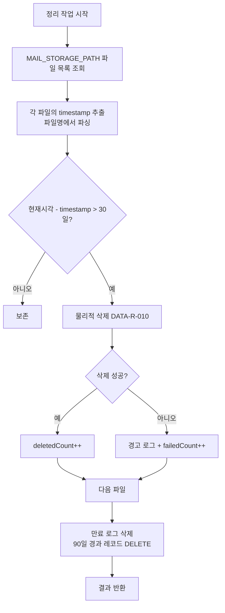

# 처리 완료 파일 관리 기능 정의

## 개요
- 보존 기간이 경과한 메일 임시 파일 삭제 및 오래된 처리 로그 삭제 기능을 정의한다.
- 적용 범위: 백그라운드 스케줄러에서 주기적 실행

---

## DATA-FILE-002 처리 완료 파일 관리

### 기본 정보
| 항목 | 내용 |
|------|------|
| 기능명 | 처리 완료 파일 관리 |
| 분류 | 도메인 특화 로직 |
| 레이어 | lib/data |
| 트리거 | SCHED-001 스케줄러에 의해 주기적 호출 (메일 수신 주기에 함께 실행) |
| 관련 정책 | POL-DATA (DATA-R-008 ~ DATA-R-010, DATA-R-016) |

### 입력 / 출력

#### 1. 만료 메일 파일 삭제 (cleanupExpiredMailFiles)

##### 입력 (Input)
| 파라미터 | 타입 | 필수 | 설명 | 유효성 규칙 |
|----------|------|------|------|-------------|
| retentionDays | number | ❌ | 보존 기간 (일) | 기본값 30 (DATA-R-009) |

##### 출력 (Output)
| 항목 | 타입 | 설명 |
|------|------|------|
| deletedCount | number | 삭제된 파일 수 |
| failedCount | number | 삭제 실패 파일 수 |

#### 2. 만료 처리 로그 삭제 (cleanupExpiredLogs)

##### 입력 (Input)
| 파라미터 | 타입 | 필수 | 설명 | 유효성 규칙 |
|----------|------|------|------|-------------|
| retentionDays | number | ❌ | 보존 기간 (일) | 기본값 90 (DATA-R-016) |

##### 출력 (Output)
| 항목 | 타입 | 설명 |
|------|------|------|
| deletedCount | number | 삭제된 로그 레코드 수 |

##### 예외 / 오류
| 조건 | 오류 코드 | 설명 |
|------|-----------|------|
| 파일 삭제 실패 | ERR_FILE_DELETE | 경고 로그, 다음 주기에 재시도 (DATA-R-009) |

### 처리 흐름

### 파일 만료 판단 로직
- 파일명 형식: `{timestamp}_{hash}.txt`
- timestamp를 파싱하여 파일 생성 시점 판단
- `Date.now() - timestamp > retentionDays * 24 * 60 * 60 * 1000`이면 만료

### 구현 가이드

- **패턴**: Service 함수 - lib/data/cleanup-service.ts
- **파일 삭제**: CMN-FS-001.deleteFile (물리적 삭제, DATA-R-010)
- **로그 삭제**: Drizzle ORM DELETE WHERE created_at < 90일 전 (DATA-R-016)
- **동시성**: 스케줄러에 의해 단일 스레드 실행 보장
- **외부 의존성**: CMN-FS-001, Drizzle ORM

### 관련 기능
- **이 기능을 호출하는 기능**: SCHED-001
- **이 기능이 호출하는 기능**: CMN-FS-001, CMN-LOG-001

### 관련 데이터
- 파일 시스템: MAIL_STORAGE_PATH (`./data/mails`)
- DATA-003 MailProcessingLog (90일 보존 후 삭제)

### 테스트 시나리오

| 시나리오 | 입력 조건 | 기대 결과 |
|----------|-----------|-----------|
| 만료 파일 삭제 | 31일 전 파일 존재 | 해당 파일 삭제 |
| 미만료 파일 보존 | 29일 전 파일 존재 | 삭제하지 않음 |
| 삭제 실패 시 | 파일 잠금 등으로 삭제 불가 | 경고 로그, 다음 주기 재시도 |
| 로그 삭제 | 91일 전 로그 존재 | DB에서 DELETE |
| 빈 디렉터리 | 파일 없음 | deletedCount=0 |
