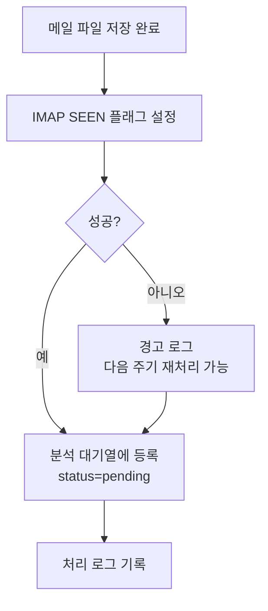

# 메일 상태 갱신 기능 정의

## 개요
- IMAP 서버에서 처리 완료된 메일의 SEEN 플래그 설정, 분석 대기열 등록, 처리 로그 기록 기능을 정의한다.
- 적용 범위: 메일 텍스트 저장 성공 후 후처리

---

## MAIL-PROC-002 메일 상태 갱신

### 기본 정보
| 항목 | 내용 |
|------|------|
| 기능명 | 메일 상태 갱신 |
| 분류 | 도메인 특화 로직 |
| 레이어 | lib/mail |
| 트리거 | DATA-FILE-001로 메일 임시 파일 저장 성공 후 |
| 관련 정책 | POL-MAIL (MAIL-R-008, MAIL-R-014, MAIL-R-015), POL-DATA (DATA-R-016) |

### 입력 / 출력

#### 1. SEEN 플래그 설정 (markAsSeen)

##### 입력 (Input)
| 파라미터 | 타입 | 필수 | 설명 | 유효성 규칙 |
|----------|------|------|------|-------------|
| imapClient | ImapFlow | ✅ | 활성 IMAP 연결 | - |
| uid | number | ✅ | 메일 UID | - |

##### 출력 (Output)
| 항목 | 타입 | 설명 |
|------|------|------|
| success | boolean | 플래그 설정 성공 여부 |

##### 예외 / 오류
| 조건 | 오류 코드 | 설명 |
|------|-----------|------|
| 플래그 설정 실패 | ERR_IMAP_FLAG | 경고 로그 기록, 다음 주기에 재처리 가능 (MAIL-R-008) |

#### 2. 분석 대기열 등록 (enqueueForAnalysis)

##### 입력 (Input)
| 파라미터 | 타입 | 필수 | 설명 | 유효성 규칙 |
|----------|------|------|------|-------------|
| fileName | string | ✅ | 저장된 메일 파일명 | {timestamp}_{hash}.txt 형식 |
| mailSubject | string | ❌ | 메일 제목 | - |
| mailReceivedAt | string | ❌ | 메일 수신일시 | ISO 8601 |

##### 출력 (Output)
| 항목 | 타입 | 설명 |
|------|------|------|
| queueId | string | 분석 대기열 레코드 ID |

#### 3. 처리 로그 기록 (logProcessingResult)

##### 입력 (Input)
| 파라미터 | 타입 | 필수 | 설명 | 유효성 규칙 |
|----------|------|------|------|-------------|
| processType | string | ✅ | 프로세스 유형 | "mail_receive" 또는 "term_analysis" |
| status | string | ✅ | 실행 결과 | "success" / "failure" / "skipped" |
| mailCount | number | ❌ | 처리 건수 | 기본값 0 |
| analyzedCount | number | ❌ | 분석 건수 | 기본값 0 |
| errorMessage | string | ❌ | 오류 메시지 | 최대 1000자 |

##### 출력 (Output)
| 항목 | 타입 | 설명 |
|------|------|------|
| logId | string | 처리 로그 레코드 ID |

### 처리 흐름

### 구현 가이드

- **패턴**: Service 함수 - lib/mail/mail-status-service.ts
- **SEEN 플래그**: imapflow의 `client.messageFlagsAdd(uid, ['\\Seen'])` 사용
- **분석 대기열**: analysis_queue 테이블에 INSERT (DATA-007)
- **처리 로그**: mail_processing_logs 테이블에 INSERT (DATA-003)
- **트랜잭션**: 대기열 등록과 로그 기록은 DB 트랜잭션으로 묶기 권장
- **외부 의존성**: imapflow, Drizzle ORM

### 관련 기능
- **이 기능을 호출하는 기능**: TERM-BATCH-001
- **이 기능이 호출하는 기능**: CMN-LOG-001

### 관련 데이터
- DATA-003 MailProcessingLog (mail_processing_logs 테이블)
- DATA-007 AnalysisQueue (analysis_queue 테이블)

### 테스트 시나리오

| 시나리오 | 입력 조건 | 기대 결과 |
|----------|-----------|-----------|
| SEEN 플래그 정상 설정 | 유효한 IMAP 연결, uid | success=true |
| SEEN 플래그 실패 | IMAP 연결 끊김 | success=false, 경고 로그 |
| 대기열 등록 | 새 파일명 | pending 상태로 등록 |
| 중복 대기열 등록 | 이미 등록된 파일명 | 기존 레코드 유지 (UNIQUE 제약) |
| 처리 로그 기록 | 수신 5건 성공 | mail_receive, success, mailCount=5 |
