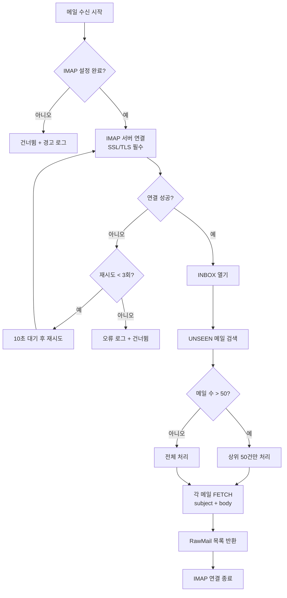

# IMAP 메일 수신 기능 정의

## 개요
- imapflow 기반 IMAP 메일함 접속 및 UNSEEN(읽지 않은) 메일 수신 기능을 정의한다.
- 적용 범위: 백그라운드 메일 수신 프로세스

---

## MAIL-RECV-001 IMAP 메일 수신

### 기본 정보
| 항목 | 내용 |
|------|------|
| 기능명 | IMAP 메일 수신 |
| 분류 | 도메인 특화 로직 |
| 레이어 | lib/mail |
| 트리거 | SCHED-001 스케줄러에 의해 주기적 호출 |
| 관련 정책 | POL-MAIL (MAIL-R-001 ~ MAIL-R-009) |

### 입력 / 출력

#### fetchUnseenMails

##### 입력 (Input)
| 파라미터 | 타입 | 필수 | 설명 | 유효성 규칙 |
|----------|------|------|------|-------------|
| imapConfig | ImapConfig | ✅ | IMAP 접속 정보 (CMN-CFG-001에서 조회) | host, port, username, password 필수 |

##### 출력 (Output)
| 항목 | 타입 | 설명 |
|------|------|------|
| mails | RawMail[] | 수신된 메일 목록 (uid, subject, body, date, messageId) |
| count | number | 수신 건수 |

```typescript
interface RawMail {
  uid: number;          // IMAP UID (SEEN 플래그 설정에 사용)
  messageId: string;    // Message-ID 헤더
  subject: string;      // 메일 제목
  body: string;         // 메일 본문 (텍스트 또는 HTML)
  isHtml: boolean;      // HTML 형식 여부
  date: Date;           // 수신 일시
}
```

##### 예외 / 오류
| 조건 | 오류 코드 | 설명 |
|------|-----------|------|
| IMAP 연결 실패 (3회 재시도 후) | ERR_IMAP_CONNECTION | MAIL-R-003 |
| SSL/TLS 미사용 | ERR_IMAP_INSECURE | MAIL-R-001 |
| 환경변수 미설정 | ERR_IMAP_NOT_CONFIGURED | MAIL-R-002 |

### 처리 흐름



### 구현 가이드

- **패턴**: Service 함수 - lib/mail/imap-service.ts
- **IMAP 클라이언트**: imapflow 라이브러리 사용
  - `new ImapFlow({ host, port, secure: true, auth: { user, pass } })`
  - `client.connect()` -> `client.getMailboxLock('INBOX')` -> `client.search({ seen: false })` -> `client.fetchOne(uid, { source: true })`
- **동시성**: 단일 IMAP 연결로 순차 처리 (MAIL-R-006 중복 실행 방지는 SCHED-001 책임)
- **보안**: SSL/TLS 필수 (MAIL-R-001), 비밀번호는 환경변수에서만 읽음
- **성능**: 1회 최대 50건 (MAIL-R-009)
- **외부 의존성**: imapflow

### 관련 기능
- **이 기능을 호출하는 기능**: TERM-BATCH-001
- **이 기능이 호출하는 기능**: CMN-CFG-001 (IMAP 설정 조회), CMN-HTTP-001 (재시도), CMN-LOG-001

### 관련 데이터
- DATA-003 MailProcessingLog (실행 이력)

### 테스트 시나리오

| 시나리오 | 입력 조건 | 기대 결과 |
|----------|-----------|-----------|
| 정상 수신 | IMAP 설정 완료, UNSEEN 메일 3건 | RawMail 3건 반환 |
| 메일 없음 | UNSEEN 메일 0건 | 빈 배열 반환 |
| 50건 초과 | UNSEEN 메일 80건 | 50건만 반환 (MAIL-R-009) |
| IMAP 미설정 | host 미설정 | ERR_IMAP_NOT_CONFIGURED, 건너뜀 |
| 연결 실패 후 재시도 성공 | 1회 실패, 2회 성공 | 정상 수신 |
| 3회 연속 실패 | 네트워크 장애 | ERR_IMAP_CONNECTION, 건너뜀 |
| SSL 미지원 서버 | secure=false 설정 | ERR_IMAP_INSECURE |
