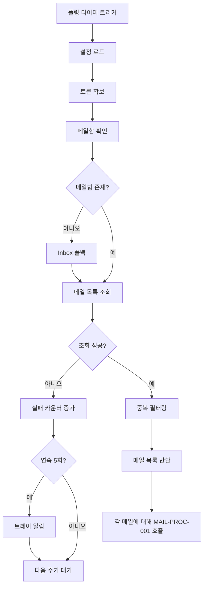

# 메일 폴링 및 수신 기능 정의

## 개요

- **기능 목적**: 설정된 메일함을 주기적으로 확인하여 신규 메일 목록을 조회하고, 중복 처리를 방지한다.
- **적용 범위**: 메일 수신 도메인의 진입점으로, 백그라운드에서 주기적으로 실행된다.

---

## MAIL-RECV-001: 메일 폴링 및 수신

### 기본 정보

| 항목 | 내용 |
|------|------|
| 기능명 | 메일 폴링 및 수신 |
| 분류 | 도메인 특화 로직 |
| 레이어 | Application |
| 트리거 | 타이머 기반 주기 실행 (pollIntervalSeconds 간격) |
| 관련 정책 | POL-MAIL (MAIL-01, MAIL-02, MAIL-03, MAIL-06) |

### 입력 / 출력

#### 입력 (Input)

설정값으로부터 자동 로드 (CMN-CFG-001):

| 파라미터 | 타입 | 설명 | 출처 |
|----------|------|------|------|
| pollIntervalSeconds | int | 폴링 주기 | MAIL_POLL_INTERVAL_SECONDS |
| mailboxName | string | 대상 메일함 | MAIL_MAILBOX_NAME |
| fetchUnreadOnly | boolean | 읽지 않은 메일만 | MAIL_FETCH_UNREAD_ONLY |
| maxFetchCount | int | 1회 최대 조회 수 | MAIL_MAX_FETCH_COUNT |
| userEmail | string | 메일 계정 | MAIL_USER_EMAIL |

#### 출력 (Output)

| 항목 | 타입 | 설명 |
|------|------|------|
| fetchedMails | MailMessage[] | 조회된 신규 메일 목록 |
| fetchCount | int | 조회 건수 |
| hasErrors | boolean | 오류 발생 여부 |

#### 예외 / 오류

| 조건 | 오류 코드 | 설명 |
|------|-----------|------|
| 인증 실패 | ERR_MAIL_AUTH_FAILED | Graph API 인증 실패 (CMN-AUTH-001 위임) |
| 메일함 미존재 | ERR_MAIL_FOLDER_NOT_FOUND | 지정 메일함이 존재하지 않음 |
| 연속 실패 | ERR_MAIL_CONSECUTIVE_FAILURE | 5회 연속 실패 (트레이 알림 발생) |
| Rate Limit | ERR_MAIL_RATE_LIMITED | Graph API 요청 제한 초과 |

### 처리 흐름

1. **설정 로드**: CMN-CFG-001에서 폴링 설정을 가져온다.
2. **토큰 확보**: CMN-AUTH-001에서 Graph API Access Token을 확보한다.
3. **메일함 확인**: Graph API로 지정 메일함의 존재를 확인한다.
   - 미존재 시: 경고 로그 후 Inbox로 폴백 (MAIL-02).
4. **메일 목록 조회**: Graph API `/messages` 엔드포인트에 필터를 적용하여 조회한다.
   - fetchUnreadOnly=true: `isRead eq false` 필터 (MAIL-03)
   - 정렬: `receivedDateTime desc` (MAIL-03)
   - 상한: `$top={maxFetchCount}` (MAIL-03)
5. **중복 필터링**: 로컬에 기록된 처리 완료 Message ID와 대조하여 이미 처리된 메일을 제외한다 (MAIL-03).
6. **연속 실패 카운트**: 실패 시 연속 실패 카운터를 증가시킨다.
   - 5회 이상 시 CMN-NOTI-001로 트레이 알림 발송 (MAIL-06).
   - 성공 시 카운터를 초기화한다.
7. **결과 반환**: 조회된 메일 목록을 반환한다.

### 구현 가이드

- **패턴**: BackgroundService / Timer 기반 주기 실행. 폴링 주기는 설정 변경 시 즉시 반영 (CMN-CFG-001 Observer).
- **동시성**: 이전 폴링이 완료되지 않은 상태에서 다음 주기가 도래하면 건너뛴다.
- **성능**: Graph API의 `$select` 파라미터로 필요한 필드(id, subject, body, from, receivedDateTime)만 요청한다.
- **외부 의존성**: Microsoft Graph API (`/users/{email}/mailFolders/{folder}/messages`)

### 관련 기능

- **이 기능을 호출하는 기능**: 없음 (타이머에 의해 자동 실행)
- **이 기능이 호출하는 기능**: CMN-AUTH-001, CMN-CFG-001, CMN-HTTP-001, CMN-NOTI-001, CMN-LOG-001, MAIL-PROC-001

### 테스트 시나리오

| 시나리오 | 입력 조건 | 기대 결과 |
|----------|-----------|-----------|
| 정상 수신 | 5건의 미읽은 메일 존재 | 5건 조회 반환 |
| 읽은 메일 필터링 | fetchUnreadOnly=true, 읽은 메일 3건 | 0건 반환 |
| 중복 필터링 | 이전 처리 완료된 메일 2건 | 해당 2건 제외 |
| 메일함 미존재 | 잘못된 mailboxName | 경고 로그, Inbox 폴백 후 조회 |
| 연속 5회 실패 | API 5회 연속 오류 | 트레이 알림 발송 |
| Rate Limit | HTTP 429 응답 | CMN-HTTP-001 통해 Retry-After 대기 |
| 대용량 메일 | 본문 2MB | 1MB까지만 추출, 메타데이터 기록 (MAIL-05 제약) |
| 폴링 중복 방지 | 이전 폴링 미완료 시 | 다음 폴링 건너뜀 |
