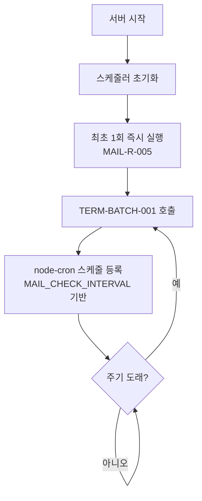

# 백그라운드 스케줄러 기능 정의

## 개요
- node-cron 기반 주기적 메일 수신/분석 작업 실행 및 중복 실행 방지 기능을 정의한다.
- Next.js 서버 프로세스 내에서 백그라운드 작업으로 실행된다.
- 적용 범위: 서버 시작 시 스케줄러 초기화, 주기적 배치 실행

---

## SCHED-001 백그라운드 스케줄러

### 기본 정보
| 항목 | 내용 |
|------|------|
| 기능명 | 백그라운드 스케줄러 |
| 분류 | 도메인 특화 로직 |
| 레이어 | lib/scheduler |
| 트리거 | 서버 시작 시 자동 초기화 |
| 관련 정책 | POL-MAIL (MAIL-R-004, MAIL-R-005, MAIL-R-006) |

### 입력 / 출력

#### 1. 스케줄러 시작 (startScheduler)

##### 입력 (Input)
없음 (환경변수 MAIL_CHECK_INTERVAL에서 주기 조회)

##### 출력 (Output)
| 항목 | 타입 | 설명 |
|------|------|------|
| - | void | 스케줄러 시작됨 (백그라운드 실행) |

#### 2. 스케줄러 중지 (stopScheduler)

##### 입력 (Input)
없음

##### 출력 (Output)
| 항목 | 타입 | 설명 |
|------|------|------|
| - | void | 스케줄러 중지됨 |

### 처리 흐름

### 스케줄 설정

| 항목 | 값 | 관련 정책 |
|------|-----|-----------|
| 실행 주기 | MAIL_CHECK_INTERVAL (기본 3600000ms = 1시간) | MAIL-R-004 |
| 최초 실행 | 서버 시작 시 즉시 1회 | MAIL-R-005 |
| 중복 방지 | TERM-BATCH-001 내부 잠금으로 처리 | MAIL-R-006 |

### node-cron 설정

MAIL_CHECK_INTERVAL(ms)을 cron 표현식으로 변환:
- 3600000ms (1시간) -> `'0 * * * *'` (매시 0분)
- 또는 setInterval 방식으로 구현하고, node-cron은 시간 단위 이상의 스케줄링에 사용

### Next.js에서의 스케줄러 구동

Next.js 서버 프로세스 내에서 스케줄러를 실행하는 방법:
- `instrumentation.ts` 파일에서 서버 시작 시 스케줄러 초기화
- 또는 API Route의 초기화 시점에서 싱글톤으로 실행
- 개발 환경에서의 Hot Reload 시 중복 등록 방지 주의

### 구현 가이드

- **패턴**: Singleton + Observer - lib/scheduler/cron-scheduler.ts
- **node-cron**: `cron.schedule(cronExpression, callback)` 사용
- **싱글톤**: 모듈 레벨 변수로 스케줄러 인스턴스 관리, 중복 생성 방지
- **Graceful Shutdown**: process 종료 시 스케줄러 정리 (process.on('SIGTERM'))
- **개발 환경**: Next.js HMR 시 스케줄러 중복 등록 방지 로직 필요
  - `global.__scheduler` 패턴 활용
- **외부 의존성**: node-cron

### 관련 기능
- **이 기능을 호출하는 기능**: Next.js 서버 초기화 (instrumentation.ts)
- **이 기능이 호출하는 기능**: TERM-BATCH-001, DATA-FILE-002

### 테스트 시나리오

| 시나리오 | 입력 조건 | 기대 결과 |
|----------|-----------|-----------|
| 서버 시작 시 최초 실행 | 서버 기동 | 즉시 1회 배치 실행 (MAIL-R-005) |
| 주기적 실행 | 1시간 경과 | 배치 실행 |
| 스케줄러 중지 | stopScheduler 호출 | 더 이상 실행되지 않음 |
| HMR 중복 방지 | 개발 환경에서 코드 변경 | 스케줄러 1개만 유지 |
| IMAP 미설정 | 환경변수 없음 | 스케줄러는 실행되나 배치에서 건너뜀 |
