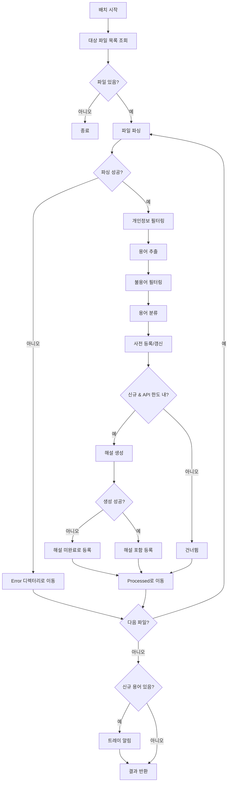

# 배치 분석 오케스트레이션 기능 정의

## 개요

- **기능 목적**: 분석 요청 폴더의 파일을 일괄 처리하는 전체 흐름을 제어한다. 파일 로드 -> 용어 추출 -> 분류 -> 해설 생성 -> 사전 등록 -> 완료 처리의 파이프라인을 오케스트레이션한다.
- **적용 범위**: 메일 수신 후 또는 주기적으로 실행되는 배치 처리의 진입점.

---

## TERM-BATCH-001: 배치 분석 오케스트레이션

### 기본 정보

| 항목 | 내용 |
|------|------|
| 기능명 | 배치 분석 오케스트레이션 |
| 분류 | 도메인 특화 로직 |
| 레이어 | Application |
| 트리거 | 메일 수신 완료 후 또는 별도 배치 스케줄 |
| 관련 정책 | POL-TERM (TERM-05, TERM-06) |

### 입력 / 출력

#### 입력 (Input)

| 파라미터 | 타입 | 필수 | 설명 | 유효성 규칙 |
|----------|------|------|------|-------------|
| analysisDir | string | ✅ | 분석 요청 폴더 경로 | 존재하는 디렉터리 |
| maxFilesPerBatch | int | | 1회 최대 처리 파일 수 | 기본값 10 (TERM-05) |
| maxApiCallsPerBatch | int | | 1배치당 최대 API 호출 수 | 기본값 20 (TERM-05) |

#### 출력 (Output)

| 항목 | 타입 | 설명 |
|------|------|------|
| processedFiles | int | 처리 완료 파일 수 |
| newTerms | int | 신규 등록 용어 수 |
| updatedTerms | int | 갱신된 용어 수 |
| failedFiles | int | 처리 실패 파일 수 |
| apiCallsUsed | int | 사용된 API 호출 수 |

#### 예외 / 오류

| 조건 | 오류 코드 | 설명 |
|------|-----------|------|
| 디렉터리 미존재 | ERR_BATCH_DIR_NOT_FOUND | 분석 요청 폴더 없음 |
| 전체 배치 실패 | ERR_BATCH_ALL_FAILED | 모든 파일 처리 실패 |

### 처리 흐름

1. **대상 파일 목록 조회**: analysisDir에서 `.txt` 파일을 생성 시간 오름차순으로 조회한다 (TERM-05).
2. **상한 적용**: maxFilesPerBatch까지만 대상으로 한다 (TERM-05).
3. **파일별 처리 루프**: 각 파일에 대해 다음을 수행한다.
   a. **파일 파싱**: YAML frontmatter와 본문을 분리하여 로드한다.
   b. **개인정보 필터링**: TERM-PII-001로 본문에서 개인정보를 제거한다.
   c. **용어 추출**: TERM-EXT-001로 용어 후보를 추출한다.
   d. **불용어 필터링**: TERM-EXT-002로 불용어를 제거한다.
   e. **용어 분류**: TERM-CLS-001로 각 용어를 분류한다.
   f. **사전 등록/갱신**: DATA-DICT-001로 용어를 사전에 등록한다.
      - 신규 용어이고 API 호출 한도 내이면: TERM-GEN-001로 해설을 생성한다.
      - 기존 용어이면: 발견 횟수만 갱신한다 (TERM-04).
   g. **처리 완료**: DATA-FILE-002로 파일을 Processed 디렉터리로 이동한다.
4. **실패 처리** (TERM-06):
   - 파일 파싱 실패: 에러 로그 후 `Error/` 디렉터리로 이동.
   - API 호출 실패: 해당 용어를 "해설 미완료"(description 비어 있음) 상태로 등록. 다음 배치에서 재시도.
   - 부분 실패: 성공한 용어는 저장, 실패한 용어만 다음 배치에서 재시도.
5. **알림 발송**: 신규 용어가 1건 이상이면 CMN-NOTI-001로 트레이 알림을 발송한다.
6. **결과 반환**: 처리 통계를 반환한다.

### 구현 가이드

- **패턴**: Pipeline 패턴으로 각 단계를 조합. 각 단계는 독립적으로 테스트 가능한 기능.
- **동시성**: 파일 처리는 순차적으로 수행한다 (API Rate Limit 고려). 배치 실행 중 다음 배치 요청이 오면 건너뛴다.
- **성능**: 1배치당 API 호출 20건 제한으로 비용을 통제한다 (TERM-05).
- **트랜잭션**: 파일 단위로 처리를 커밋한다. 한 파일의 실패가 다른 파일에 영향을 주지 않는다.

### 관련 기능

- **이 기능을 호출하는 기능**: 메일 수신 완료 이벤트, 배치 스케줄러
- **이 기능이 호출하는 기능**: TERM-PII-001, TERM-EXT-001, TERM-EXT-002, TERM-CLS-001, TERM-GEN-001, DATA-DICT-001, DATA-FILE-002, CMN-CFG-001, CMN-NOTI-001, CMN-LOG-001

### 테스트 시나리오

| 시나리오 | 입력 조건 | 기대 결과 |
|----------|-----------|-----------|
| 정상 배치 | 3개 파일, 각 5개 용어 | processedFiles=3, newTerms>0 |
| 파일 수 상한 | 15개 파일 | 10개만 처리 |
| API 호출 상한 | 25개 신규 용어 | 20개만 해설 생성, 5개 미완료 등록 |
| 파싱 실패 | 잘못된 형식 파일 | Error 디렉터리 이동, failedFiles=1 |
| 부분 실패 | 5개 중 2개 API 실패 | 3개 성공 등록, 2개 미완료 등록 |
| 빈 디렉터리 | 처리 대상 파일 없음 | processedFiles=0 |
| 중복 용어 | 기존 등록 용어 재발견 | updatedTerms 증가, API 미호출 |
| 알림 발송 | 신규 용어 3건 | "3건의 새로운 용어가 추가되었습니다" 알림 |
