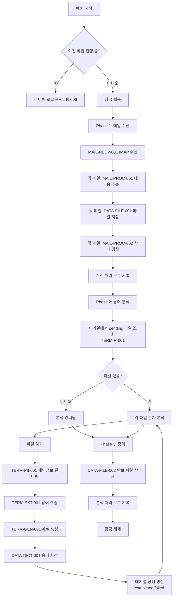
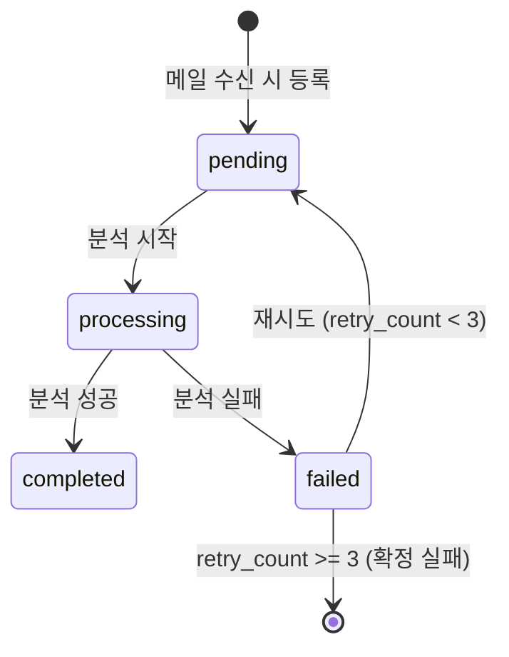

# 배치 분석 오케스트레이션 기능 정의

## 개요
- 분석 대기열(analysis_queue)에 등록된 메일 파일의 전체 분석 파이프라인을 순차 조율하는 기능을 정의한다.
- 적용 범위: 백그라운드 스케줄러에서 주기적으로 호출되는 메일 수신~분석 전체 흐름

---

## TERM-BATCH-001 배치 분석 오케스트레이션

### 기본 정보
| 항목 | 내용 |
|------|------|
| 기능명 | 배치 분석 오케스트레이션 |
| 분류 | 도메인 특화 로직 |
| 레이어 | lib/analysis |
| 트리거 | SCHED-001 스케줄러에 의해 주기적 호출 |
| 관련 정책 | POL-MAIL (MAIL-R-004 ~ MAIL-R-006), POL-TERM (TERM-R-001 ~ TERM-R-003, TERM-R-020, TERM-R-021) |

### 입력 / 출력

#### runBatchAnalysis

##### 입력 (Input)
없음 (내부적으로 설정 및 대기열을 조회)

##### 출력 (Output)
| 항목 | 타입 | 설명 |
|------|------|------|
| mailReceiveResult | { count: number, status: string } | 메일 수신 결과 |
| analysisResult | { processed: number, succeeded: number, failed: number } | 분석 결과 |

##### 예외 / 오류
| 조건 | 오류 코드 | 설명 |
|------|-----------|------|
| 이전 작업 진행 중 | SKIP_CONCURRENT | 중복 실행 건너뜀 (MAIL-R-006) |

### 처리 흐름

### 분석 파이프라인 (파일 단위)

### 대기열 상태 전이 (TERM-R-020)

### 재시도 정책 (TERM-R-021)

- 분석 실패 시 retry_count 증가
- retry_count < 3이면 다음 주기에 pending으로 복귀하여 재시도
- retry_count >= 3이면 failed 확정, 더 이상 재시도하지 않음

### 중복 실행 방지 (MAIL-R-006)

- 모듈 수준 변수(`isRunning`)로 잠금 관리
- 이전 배치가 완료되지 않은 상태에서 스케줄러가 다시 호출하면 건너뜀

### 구현 가이드

- **패턴**: Orchestrator 패턴 - lib/analysis/batch-analyzer.ts
- **순차 처리**: 메일 파일 분석은 순차 처리 (API rate limit 고려, POL-TERM 구현 가이드)
- **트랜잭션**: 각 파일의 분석 결과 저장은 DB 트랜잭션으로 묶기
- **중복 방지**: 모듈 레벨 잠금 변수 (MAIL-R-006)
- **오류 격리**: 개별 파일 분석 실패가 전체 배치를 중단하지 않음
- **외부 의존성**: 모든 하위 기능 (MAIL-RECV-001 ~ DATA-DICT-001)

### 관련 기능
- **이 기능을 호출하는 기능**: SCHED-001
- **이 기능이 호출하는 기능**: MAIL-RECV-001, MAIL-PROC-001, MAIL-PROC-002, DATA-FILE-001, DATA-FILE-002, TERM-EXT-001, TERM-GEN-001, TERM-PII-001, DATA-DICT-001, CMN-CFG-001, CMN-LOG-001

### 관련 데이터
- DATA-007 AnalysisQueue (analysis_queue 테이블)
- DATA-003 MailProcessingLog (처리 로그)

### 테스트 시나리오

| 시나리오 | 입력 조건 | 기대 결과 |
|----------|-----------|-----------|
| 전체 정상 흐름 | 메일 3건, 모두 분석 성공 | mailCount=3, succeeded=3 |
| 메일 없음 | UNSEEN 메일 0건 | mailCount=0, 분석 건너뜀 |
| 일부 분석 실패 | 3건 중 1건 API 실패 | succeeded=2, failed=1 |
| 중복 실행 방지 | 이전 배치 실행 중 | SKIP_CONCURRENT, 건너뜀 |
| 재시도 성공 | retry_count=1인 파일 | 분석 성공, completed로 전환 |
| 재시도 3회 소진 | retry_count=2인 파일, 또 실패 | failed 확정 |
| IMAP 미설정 | IMAP 환경변수 없음 | 메일 수신 건너뜀, 기존 대기열만 분석 |
| API 키 미설정 | ANTHROPIC_API_KEY 없음 | 메일 수신 후 분석 건너뜀 |
