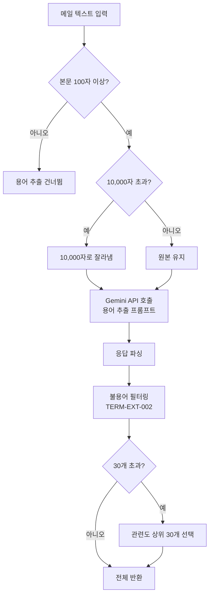

# 용어 추출 기능 정의

## 개요
- Gemini API를 사용하여 메일 본문에서 EMR 시스템 관련 용어, 비즈니스 용어, 약어를 추출하는 기능을 정의한다.
- 적용 범위: 메일 분석 파이프라인의 용어 추출 단계

---

## TERM-EXT-001 용어 추출

### 기본 정보
| 항목 | 내용 |
|------|------|
| 기능명 | 용어 추출 |
| 분류 | 도메인 특화 로직 |
| 레이어 | lib/analysis |
| 트리거 | TERM-BATCH-001 배치 분석 파이프라인에서 호출 |
| 관련 정책 | POL-TERM (TERM-R-004, TERM-R-005, TERM-R-009, TERM-R-013, TERM-R-015) |

### 입력 / 출력

#### extractTerms

##### 입력 (Input)
| 파라미터 | 타입 | 필수 | 설명 | 유효성 규칙 |
|----------|------|------|------|-------------|
| mailText | string | ✅ | 메일 본문 텍스트 | 최대 10,000자 (TERM-R-009), 초과 시 잘라냄 |
| stopWords | string[] | ❌ | 불용어 목록 | TERM-EXT-002에서 조회 |

##### 출력 (Output)
| 항목 | 타입 | 설명 |
|------|------|------|
| terms | ExtractedTerm[] | 추출된 용어 목록 (최대 30개, TERM-R-015) |

```typescript
interface ExtractedTerm {
  name: string;           // 용어명
  category: "emr" | "business" | "abbreviation" | "general";  // 분류
  relevanceScore: number; // 관련도 점수 (0~1)
}
```

##### 예외 / 오류
| 조건 | 오류 코드 | 설명 |
|------|-----------|------|
| API 호출 실패 (재시도 후) | ERR_API_FAILED | TERM-R-007 |
| API 응답 파싱 실패 | ERR_API_PARSE | 응답이 기대 형식이 아님 |
| 본문 100자 미만 | ERR_TEXT_TOO_SHORT | 용어 분석 건너뜀 (예외사항) |

### 처리 흐름



### Gemini API 프롬프트 설계

시스템 프롬프트는 별도 파일(`lib/analysis/prompts/extract-terms.ts`)로 관리하여 유지보수성 확보.

프롬프트 요구사항:
- 메일 본문에서 EMR 시스템 용어, 비즈니스 용어, 약어를 추출
- 각 용어에 대해 분류(emr/business/abbreviation/general)와 관련도 점수 부여
- 불용어 목록을 전달하여 제외
- 응답 형식: JSON 배열

### 구현 가이드

- **패턴**: Service 함수 - lib/analysis/term-extractor.ts
- **API SDK**: @google/generative-ai 사용 (TERM-R-004)
- **모델**: 환경변수 GEMINI_MODEL (기본 gemini-2.0-flash) (TERM-R-005)
- **재시도**: CMN-HTTP-001 활용 (최대 2회 재시도, 5초 간격, TERM-R-007)
- **타임아웃**: 60초 (TERM-R-008)
- **프롬프트 관리**: 별도 파일로 분리
- **외부 의존성**: @google/generative-ai, CMN-HTTP-001

### 관련 기능
- **이 기능을 호출하는 기능**: TERM-BATCH-001
- **이 기능이 호출하는 기능**: TERM-EXT-002 (불용어 필터링), TERM-CLS-001 (분류 검증), CMN-HTTP-001, CMN-LOG-001

### 관련 데이터
- DATA-006 StopWord (불용어 조회)

### 테스트 시나리오

| 시나리오 | 입력 조건 | 기대 결과 |
|----------|-----------|-----------|
| 정상 추출 | 1000자 메일, 관련 용어 10개 | 10개 용어 반환 |
| 30개 초과 | 50개 용어 추출 | 관련도 상위 30개 반환 (TERM-R-015) |
| 본문 10,000자 초과 | 15,000자 메일 | 10,000자로 잘린 후 분석 |
| 본문 100자 미만 | 50자 메일 | 용어 추출 건너뜀 |
| API 실패 후 재시도 성공 | 1회 실패, 2회 성공 | 정상 추출 |
| API 3회 모두 실패 | 네트워크 장애 | ERR_API_FAILED |
| 불용어 제외 | 추출 결과에 불용어 포함 | 불용어 제거 후 반환 |
