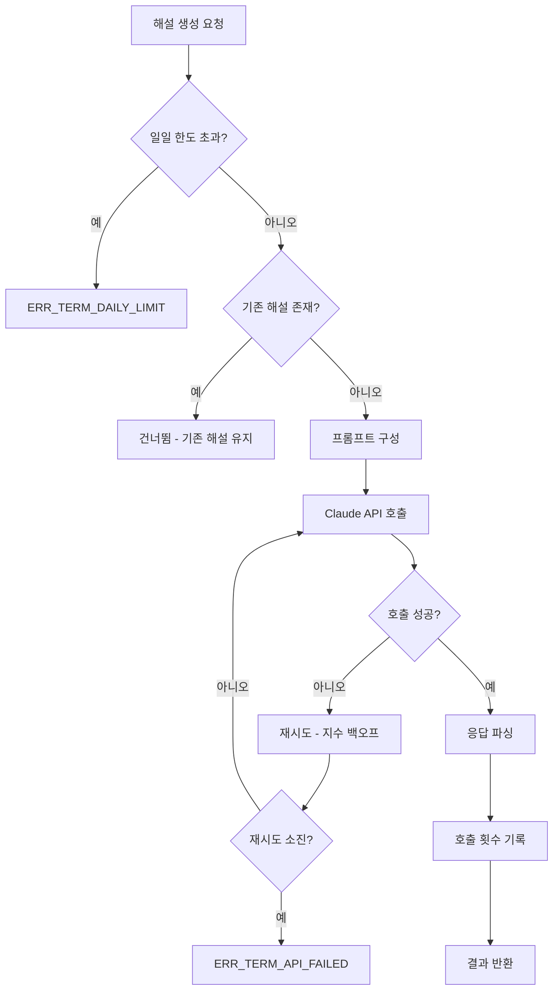

# 해설 생성 기능 정의

## 개요

- **기능 목적**: Claude API를 호출하여 용어에 대한 해설(1줄 요약, 상세 설명, 관련 용어)을 생성한다.
- **적용 범위**: 배치 분석(TERM-BATCH-001)에서 신규 용어에 대해 호출된다.

---

## TERM-GEN-001: 해설 생성

### 기본 정보

| 항목 | 내용 |
|------|------|
| 기능명 | 해설 생성 |
| 분류 | 도메인 특화 로직 |
| 레이어 | Application (오케스트레이션) + Infrastructure (API 호출) |
| 트리거 | TERM-BATCH-001에서 신규 용어 등록 시 |
| 관련 정책 | POL-TERM (TERM-03), POL-AUTH (AUTH-04) |

### 입력 / 출력

#### 입력 (Input)

| 파라미터 | 타입 | 필수 | 설명 | 유효성 규칙 |
|----------|------|------|------|-------------|
| term | string | ✅ | 해설 대상 용어 | 2자 이상 |
| category | enum | ✅ | 용어 카테고리 | EMR / Business / Abbreviation |
| context | string | ✅ | 용어 발견 컨텍스트 (전후 200자) | |
| subject | string | ✅ | 출처 메일 제목 | |

#### 출력 (Output)

| 항목 | 타입 | 설명 |
|------|------|------|
| summary | string | 1줄 요약 (50자 이내) |
| description | string | 상세 설명 (200자 이내) |
| relatedTerms | string[] | 관련 용어 목록 |
| success | boolean | 생성 성공 여부 |

#### 예외 / 오류

| 조건 | 오류 코드 | 설명 |
|------|-----------|------|
| API 호출 실패 | ERR_TERM_API_FAILED | Claude API 응답 오류 (재시도 소진) |
| 응답 파싱 실패 | ERR_TERM_PARSE_FAILED | API 응답을 기대 형식으로 파싱 불가 |
| 일일 한도 초과 | ERR_TERM_DAILY_LIMIT | 일일 최대 API 호출 200건 초과 |

### 처리 흐름

1. **일일 한도 확인**: 금일 API 호출 횟수가 200건 미만인지 확인한다 (POL-TERM 제약사항).
2. **기등록 확인**: 해당 용어가 이미 사전에 해설이 있는지 확인한다. 있으면 해설을 재생성하지 않는다 (TERM-03).
3. **프롬프트 구성**: 다음 컨텍스트를 포함하여 프롬프트를 작성한다 (TERM-03):
   - 용어 원문
   - 카테고리 (EMR/Business/Abbreviation)
   - 메일 제목
   - 용어 전후 200자 컨텍스트
   - 응답 형식 지시 (1줄 요약 50자 이내, 상세 설명 200자 이내, 관련 용어)
4. **API 호출**: Claude API를 호출한다. CMN-AUTH-001에서 API 키를 사용하고, CMN-HTTP-001의 지수 백오프 재시도를 적용한다 (AUTH-04).
5. **응답 파싱**: API 응답에서 summary, description, relatedTerms를 추출한다.
6. **호출 횟수 기록**: 일일 호출 카운터를 증가시킨다.
7. **결과 반환**: 해설 데이터를 반환한다.

### 구현 가이드

- **패턴**: `ITermExplanationGenerator` 인터페이스로 추상화. Claude API 이외의 AI 모델로 교체 가능하도록 설계.
- **성능**: 배치 내에서 순차 호출 (병렬 호출 시 Rate Limit 위험). 1배치당 최대 20건 제한 (TERM-05).
- **보안**: 프롬프트에 개인정보가 포함되지 않도록 TERM-PII-001을 사전 적용.
- **외부 의존성**: Claude API (Anthropic Messages API)

### 관련 기능

- **이 기능을 호출하는 기능**: TERM-BATCH-001
- **이 기능이 호출하는 기능**: CMN-AUTH-001, CMN-HTTP-001, CMN-LOG-001

### 테스트 시나리오

| 시나리오 | 입력 조건 | 기대 결과 |
|----------|-----------|-----------|
| 정상 생성 | 신규 용어 "PACS", 유효한 컨텍스트 | summary, description, relatedTerms 반환 |
| 기등록 용어 | 이미 해설이 있는 용어 | 건너뜀, API 미호출 |
| 일일 한도 초과 | 200건 이미 소진 | ERR_TERM_DAILY_LIMIT |
| API 실패 재시도 | 1차 실패, 2차 성공 | 2차에서 결과 반환 |
| 재시도 소진 | 3회 연속 실패 | ERR_TERM_API_FAILED |
| 응답 파싱 실패 | 예상과 다른 응답 형식 | ERR_TERM_PARSE_FAILED |
| 요약 길이 검증 | 50자 초과 요약 | 50자에서 잘라서 저장 |
