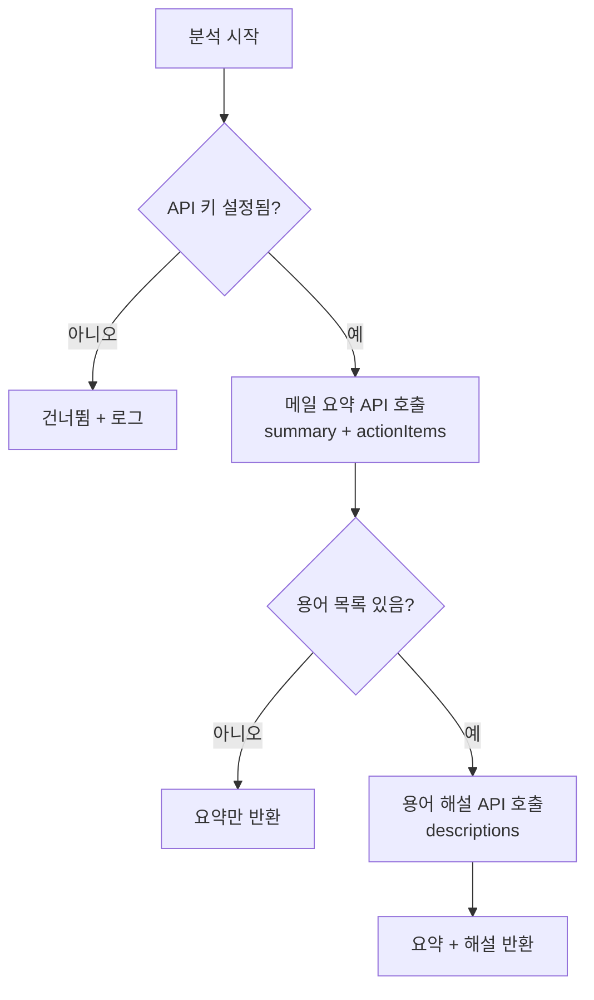

# 해설 생성 기능 정의

## 개요
- Claude API를 사용하여 추출된 용어별 한국어 해설과 메일 요약/후속 작업 제안을 생성하는 기능을 정의한다.
- 적용 범위: 메일 분석 파이프라인의 해설 생성 및 메일 요약 단계

---

## TERM-GEN-001 해설 생성

### 기본 정보
| 항목 | 내용 |
|------|------|
| 기능명 | 해설 생성 |
| 분류 | 도메인 특화 로직 |
| 레이어 | lib/analysis |
| 트리거 | TERM-BATCH-001 배치 분석 파이프라인에서 호출 |
| 관련 정책 | POL-TERM (TERM-R-004 ~ TERM-R-012, TERM-R-014) |

### 입력 / 출력

#### 1. 메일 요약 및 후속 작업 생성 (generateMailSummary)

##### 입력 (Input)
| 파라미터 | 타입 | 필수 | 설명 | 유효성 규칙 |
|----------|------|------|------|-------------|
| mailText | string | ✅ | 메일 본문 텍스트 | 최대 10,000자 (TERM-R-009) |

##### 출력 (Output)
| 항목 | 타입 | 설명 |
|------|------|------|
| summary | string | 핵심 내용 요약 (최대 500자, TERM-R-010) |
| actionItems | string[] | 후속 작업 제안 (최대 5개, TERM-R-011) |

#### 2. 용어 해설 생성 (generateTermDescriptions)

##### 입력 (Input)
| 파라미터 | 타입 | 필수 | 설명 | 유효성 규칙 |
|----------|------|------|------|-------------|
| terms | ExtractedTerm[] | ✅ | 추출된 용어 목록 | 최대 30개 |
| mailContext | string | ❌ | 메일 본문 (맥락 제공용) | - |

##### 출력 (Output)
| 항목 | 타입 | 설명 |
|------|------|------|
| descriptions | TermDescription[] | 용어별 해설 목록 |

```typescript
interface TermDescription {
  name: string;        // 용어명
  category: string;    // 분류
  description: string; // 한국어 해설 (TERM-R-014)
}
```

##### 예외 / 오류
| 조건 | 오류 코드 | 설명 |
|------|-----------|------|
| API 호출 실패 (재시도 후) | ERR_API_FAILED | TERM-R-007 |
| API 키 미설정 | ERR_API_KEY_MISSING | TERM-R-006 |
| 타임아웃 | ERR_API_TIMEOUT | TERM-R-008 |

### 처리 흐름



### Claude API 호출 설정

| 항목 | 값 | 관련 정책 |
|------|-----|-----------|
| SDK | @anthropic-ai/sdk | TERM-R-004 |
| 모델 | ANTHROPIC_MODEL 환경변수 (기본 claude-sonnet-4-6) | TERM-R-005 |
| 재시도 | 최대 2회, 5초 간격 | TERM-R-007 |
| 타임아웃 | 60초 | TERM-R-008 |
| 입력 제한 | 10,000자 | TERM-R-009 |

### 프롬프트 관리

프롬프트 파일은 `lib/analysis/prompts/` 디렉터리에 분리 관리:
- `generate-summary.ts` - 메일 요약 + 후속 작업 프롬프트
- `generate-descriptions.ts` - 용어 해설 생성 프롬프트

요약 프롬프트 요구사항:
- 메일 핵심 내용 요약 (최대 500자)
- 후속 작업 제안 (최대 5개)
- 한국어로 출력

해설 프롬프트 요구사항:
- 각 용어에 대한 한국어 해설 생성 (TERM-R-014)
- 메일 맥락을 고려한 해설
- JSON 형식 응답

### 구현 가이드

- **패턴**: Service 함수 - lib/analysis/description-generator.ts
- **API 호출 최적화**: 요약과 용어 해설을 가능하면 단일 API 호출로 처리
- **재시도**: CMN-HTTP-001 활용
- **프롬프트 분리**: 별도 파일로 관리하여 유지보수성 확보
- **외부 의존성**: @anthropic-ai/sdk, CMN-HTTP-001

### 관련 기능
- **이 기능을 호출하는 기능**: TERM-BATCH-001
- **이 기능이 호출하는 기능**: CMN-HTTP-001, CMN-LOG-001

### 테스트 시나리오

| 시나리오 | 입력 조건 | 기대 결과 |
|----------|-----------|-----------|
| 정상 요약 생성 | 1000자 메일 | 요약 (500자 이내) + 후속 작업 (5개 이내) |
| 정상 해설 생성 | 10개 용어 | 10개 용어별 한국어 해설 |
| API 키 미설정 | ANTHROPIC_API_KEY 없음 | ERR_API_KEY_MISSING, 건너뜀 |
| API 실패 후 재시도 | 1회 실패, 2회 성공 | 정상 생성 |
| 타임아웃 | 60초 초과 | ERR_API_TIMEOUT 후 재시도 |
| 본문 100자 미만 | 50자 메일 | 요약만 생성, 용어 분석 건너뜀 |
