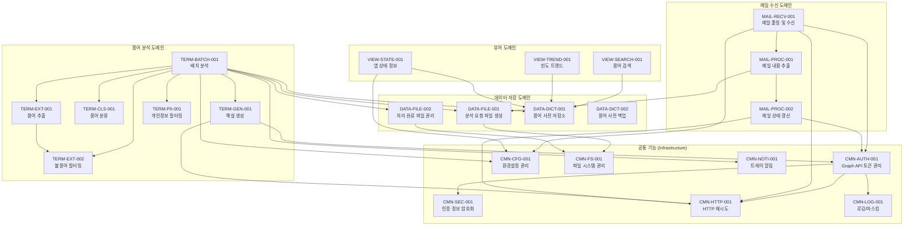

# 기능 정의 목록

## 개요

본 문서는 메일 수신 용어 해설 업무 지원 도구의 기능을 정의합니다.
PRD 및 정책 문서(POL-AUTH, POL-MAIL, POL-DATA, POL-TERM, POL-UI)에 기반하여 공통 기능과 도메인 특화 로직을 분류하고, 각 기능의 역할과 의존 관계를 명세합니다.

### 설계 원칙

- **단일 책임 원칙**: 하나의 기능은 하나의 명확한 책임만 가진다.
- **의존성 방향**: Infrastructure -> Application -> Domain (단방향)
- **외부 의존성 추상화**: 외부 시스템(Graph API, Claude API, 파일 시스템)은 인터페이스로 추상화한다.
- **순수 함수 지향**: 도메인 특화 로직은 외부 상태에 의존하지 않도록 설계한다.

### 레이어 구조

| 레이어 | 역할 | 포함 기능 유형 |
|--------|------|---------------|
| **Domain** | 비즈니스 규칙, 용어 분류/추출/검색 로직 | 도메인 특화 로직 (순수 함수) |
| **Application** | 유스케이스 오케스트레이션, 배치 처리 흐름 제어 | 도메인 로직 조합, 트랜잭션 관리 |
| **Infrastructure** | 외부 시스템 연동 (Graph API, Claude API, 파일 I/O, 암호화) | 공통 기능 (어댑터) |

### 의존성 규칙

- Domain 레이어는 다른 레이어에 의존하지 않는다.
- Application 레이어는 Domain 레이어에만 의존한다.
- Infrastructure 레이어는 Domain/Application의 인터페이스를 구현한다.
- 공통 기능(횡단 관심사)은 모든 레이어에서 사용 가능하나, 인터페이스를 통해 접근한다.

## 진행 상태 범례

- ✅ 정의 완료
- 🔄 검토 중
- 📋 정의 예정
- ⏸️ 보류

## 공통 기능 목록

| 코드 | 기능명 | 분류 | 설명 | 관련 정책 | 상태 |
|------|--------|------|------|-----------|------|
| CMN-AUTH-001 | Graph API 토큰 관리 | 인증 | OAuth 2.0 토큰 발급, 캐싱, 자동 갱신 | POL-AUTH (AUTH-01, AUTH-03) | ✅ |
| CMN-SEC-001 | 인증 정보 암호화 관리 | 보안 | DPAPI/Credential Manager를 통한 인증 정보 암호화 저장/조회 | POL-AUTH (AUTH-02) | ✅ |
| CMN-CFG-001 | 환경설정 관리 | 설정 | 설정값 읽기/쓰기/유효성 검사, 환경변수 폴백 | POL-MAIL, POL-DATA, POL-TERM | ✅ |
| CMN-HTTP-001 | HTTP 재시도 처리 | 통신 | 지수 백오프, Rate Limit 대응, 재시도 정책 적용 | POL-AUTH (AUTH-04), POL-MAIL (MAIL-06) | ✅ |
| CMN-FS-001 | 파일 시스템 관리 | 파일 | 디렉터리 보장, 파일 이동, 디스크 용량 확인 | POL-DATA (DATA-01, DATA-06) | ✅ |
| CMN-LOG-001 | 로깅 및 민감정보 마스킹 | 로깅 | 구조화 로깅, 인증 정보 자동 마스킹 | POL-AUTH (제약사항) | ✅ |
| CMN-NOTI-001 | 트레이 알림 발송 | 알림 | 풍선 알림 표시, 이벤트 유형별 메시지 관리 | POL-UI (UI-02) | ✅ |

## 도메인 특화 로직 목록

| 코드 | 기능명 | 도메인 | 설명 | 관련 정책 | 상태 |
|------|--------|--------|------|-----------|------|
| MAIL-RECV-001 | 메일 폴링 및 수신 | 메일 수신 | 메일함 주기적 확인, 신규 메일 목록 조회 | POL-MAIL (MAIL-01~03) | ✅ |
| MAIL-PROC-001 | 메일 내용 추출 | 메일 수신 | HTML 태그 제거, 제목/본문/메타데이터 추출 | POL-MAIL (MAIL-05) | ✅ |
| MAIL-PROC-002 | 메일 상태 갱신 | 메일 수신 | 처리 완료 메일을 읽음 상태로 변경 | POL-MAIL (MAIL-04) | ✅ |
| DATA-FILE-001 | 분석 요청 파일 생성 | 데이터 저장 | 메일 내용을 명명 규칙에 따라 텍스트 파일로 저장 | POL-DATA (DATA-01~03) | ✅ |
| DATA-FILE-002 | 처리 완료 파일 관리 | 데이터 저장 | 분석 완료 파일을 Processed 디렉터리로 이동 | POL-DATA (DATA-06) | ✅ |
| DATA-DICT-001 | 용어 사전 저장소 관리 | 데이터 저장 | 용어 CRUD, 중복 처리, 발견 횟수 갱신 | POL-DATA (DATA-04), POL-TERM (TERM-04) | ✅ |
| DATA-DICT-002 | 용어 사전 백업 | 데이터 저장 | 앱 종료 시 백업 생성, 오래된 백업 정리 | POL-DATA (DATA-05) | ✅ |
| TERM-EXT-001 | 용어 추출 | 용어 분석 | 텍스트에서 패턴 매칭으로 후보 용어 추출 | POL-TERM (TERM-01, TERM-02) | ✅ |
| TERM-EXT-002 | 불용어 필터링 | 용어 분석 | 불용어 목록 기반 일반 단어/약어 필터링 | POL-TERM (TERM-02) | ✅ |
| TERM-CLS-001 | 용어 분류 | 용어 분석 | 추출된 용어를 EMR/Business/Abbreviation으로 분류 | POL-TERM (TERM-01) | ✅ |
| TERM-GEN-001 | 해설 생성 | 용어 분석 | Claude API를 통한 용어 해설 생성 | POL-TERM (TERM-03), POL-AUTH (AUTH-04) | ✅ |
| TERM-BATCH-001 | 배치 분석 오케스트레이션 | 용어 분석 | 분석 요청 파일 일괄 처리 흐름 제어 | POL-TERM (TERM-05, TERM-06) | ✅ |
| TERM-PII-001 | 개인정보 필터링 | 용어 분석 | 해설 생성 전 개인정보(이름, 주민번호 등) 사전 제거 | POL-TERM (제약사항) | ✅ |
| VIEW-SEARCH-001 | 용어 검색 | 뷰어 | 부분 일치 검색, 관련도순 정렬, 디바운스 | POL-UI (UI-05) | ✅ |
| VIEW-TREND-001 | 빈도 트렌드 조회 | 뷰어 | 최근 7일간 빈도 증가 상위 용어 집계 | POL-UI (UI-04) | ✅ |
| VIEW-STATE-001 | 앱 상태 정보 조회 | 뷰어 | 총 용어 수, 마지막 메일 확인 시각 등 | POL-UI (UI-04) | ✅ |

## 기능 의존성 맵

## 정책-기능 매핑 검증

모든 정책의 규칙이 하나 이상의 기능에 매핑되었는지 확인합니다.

| 정책 규칙 | 매핑 기능 |
|-----------|-----------|
| AUTH-01 (Graph API 인증 방식) | CMN-AUTH-001 |
| AUTH-02 (인증 정보 저장) | CMN-SEC-001 |
| AUTH-03 (토큰 관리) | CMN-AUTH-001 |
| AUTH-04 (Claude API 인증) | CMN-AUTH-001, TERM-GEN-001 |
| MAIL-01 (모니터링 주기) | MAIL-RECV-001, CMN-CFG-001 |
| MAIL-02 (수신 대상 메일함) | MAIL-RECV-001, CMN-CFG-001 |
| MAIL-03 (메일 필터링) | MAIL-RECV-001 |
| MAIL-04 (처리 후 상태 변경) | MAIL-PROC-002 |
| MAIL-05 (내용 추출 범위) | MAIL-PROC-001 |
| MAIL-06 (오류 처리) | CMN-HTTP-001, CMN-NOTI-001 |
| DATA-01 (저장 경로) | DATA-FILE-001, CMN-FS-001 |
| DATA-02 (파일 명명 규칙) | DATA-FILE-001 |
| DATA-03 (파일 내용 형식) | DATA-FILE-001 |
| DATA-04 (용어 사전 데이터) | DATA-DICT-001 |
| DATA-05 (백업 정책) | DATA-DICT-002 |
| DATA-06 (분석 완료 파일) | DATA-FILE-002 |
| TERM-01 (용어 분류 기준) | TERM-CLS-001, TERM-EXT-001 |
| TERM-02 (용어 추출 규칙) | TERM-EXT-001, TERM-EXT-002 |
| TERM-03 (해설 생성 규칙) | TERM-GEN-001 |
| TERM-04 (중복 용어 처리) | DATA-DICT-001 |
| TERM-05 (배치 처리) | TERM-BATCH-001 |
| TERM-06 (분석 실패 처리) | TERM-BATCH-001 |
| UI-01 (트레이 아이콘) | -- (UI 프레임워크 레벨, 기능 정의 범위 외) |
| UI-02 (트레이 알림) | CMN-NOTI-001 |
| UI-03 (환경설정 화면) | CMN-CFG-001 |
| UI-04 (메인 화면) | VIEW-TREND-001, VIEW-STATE-001 |
| UI-05 (검색 동작) | VIEW-SEARCH-001 |
| UI-06 (용어 상세 표시) | DATA-DICT-001 |
| UI-07 (윈도우 크기) | -- (UI 프레임워크 레벨, 기능 정의 범위 외) |
| POL-TERM 제약사항 (개인정보 필터링) | TERM-PII-001 |
| POL-TERM 제약사항 (일일 API 호출 제한) | TERM-BATCH-001, CMN-CFG-001 |
| POL-DATA 제약사항 (디스크 용량) | CMN-FS-001, CMN-NOTI-001 |
