# 기능 정의 목록

## 개요

### 기능 설계 원칙 및 기본 규칙
- 메일 수신 용어 해설 업무 지원 웹 서비스의 기능을 공통 기능과 도메인 특화 로직으로 분류하여 정의한다.
- Next.js 15 (App Router) 기반 웹 서비스 환경에서 `lib/` 레이어 구조를 따른다.
- 각 기능은 단일 책임 원칙(SRP)을 준수하며, 순수 함수를 지향한다.
- 외부 의존성(DB, 파일 시스템, 외부 API)은 인터페이스로 추상화하여 테스트 가능성을 확보한다.

### 레이어 구조 (Next.js lib/ 기준)

```
lib/
  auth/          # 인증/세션 관련 기능 (CMN-AUTH, CMN-SESSION)
  config/        # 환경설정 관리 (CMN-CFG)
  http/          # HTTP 재시도 (CMN-HTTP)
  fs/            # 파일 시스템 관리 (CMN-FS)
  logger/        # 로깅 (CMN-LOG)
  mail/          # 메일 수신/처리 (MAIL-RECV, MAIL-PROC)
  analysis/      # 용어 분석/추출/생성 (TERM-EXT, TERM-CLS, TERM-GEN, TERM-BATCH, TERM-PII)
  dictionary/    # 용어 사전 저장소 (DATA-DICT)
  data/          # 분석 대상 파일 관리 (DATA-FILE)
  scheduler/     # 백그라운드 스케줄러 (SCHED)
  views/         # 조회용 서비스 로직 (VIEW-SEARCH, VIEW-TREND, VIEW-STATE)
  db/            # Drizzle ORM 스키마 및 DB 연결
```

### 기능 간 의존성 규칙
- **의존성 방향**: Infrastructure(DB, 파일 시스템, 외부 API) <- lib 서비스 <- API Route Handler
- 공통 기능(CMN-*)은 도메인 특화 로직에 의존하지 않는다.
- 도메인 특화 로직은 공통 기능을 호출할 수 있다.
- 기능 간 순환 참조를 금지한다.

## 진행 상태 범례
- ✅ 정의 완료
- 🔄 검토 중
- 📋 정의 예정
- ⏸️ 보류

## 공통 기능 목록

| 코드 | 기능명 | 분류 | 설명 | 상태 |
|------|--------|------|------|------|
| CMN-AUTH-001 | 웹 로그인 인증 | 인증/인가 | 아이디/비밀번호 기반 로그인 인증, bcrypt 비밀번호 검증, 사용자 계정 관리 | ✅ |
| CMN-SESSION-001 | 세션 관리 | 인증/인가 | iron-session 기반 암호화 쿠키 세션 생성/검증/삭제, 미들웨어 인증 가드 | ✅ |
| CMN-CFG-001 | 환경설정 관리 | 설정 | DB 기반 키-값 설정 저장/조회, 환경변수 통합 관리 | ✅ |
| CMN-HTTP-001 | HTTP 재시도 | 통신 | 외부 API/서비스 호출 시 지수 백오프 재시도 로직 | ✅ |
| CMN-FS-001 | 파일 시스템 관리 | 파일 처리 | 파일 읽기/쓰기/삭제, 디렉터리 보장, 경로 보안 검증 | ✅ |
| CMN-LOG-001 | 로깅 | 운영 | 구조화된 로그 기록, 로그 레벨 관리, 감사 로그 | ✅ |

## 도메인 특화 로직 목록

| 코드 | 기능명 | 도메인 | 설명 | 관련 정책 | 상태 |
|------|--------|--------|------|-----------|------|
| MAIL-RECV-001 | IMAP 메일 수신 | 메일 | imapflow 기반 IMAP 메일함 접속 및 UNSEEN 메일 수신 | POL-MAIL | ✅ |
| MAIL-PROC-001 | 메일 내용 추출 | 메일 | 수신 메일의 제목/본문 텍스트 추출, HTML-to-Text 변환 | POL-MAIL | ✅ |
| MAIL-PROC-002 | 메일 상태 갱신 | 메일 | IMAP SEEN 플래그 설정, 분석 대기열 등록, 처리 로그 기록 | POL-MAIL, POL-DATA | ✅ |
| DATA-FILE-001 | 분석 요청 파일 생성 | 데이터 | 메일 텍스트를 ./data/mails 경로에 파일로 저장 | POL-DATA | ✅ |
| DATA-FILE-002 | 처리 완료 파일 관리 | 데이터 | 30일 경과 메일 임시 파일 삭제, 90일 경과 로그 삭제 | POL-DATA | ✅ |
| DATA-DICT-001 | 용어 사전 저장소 | 데이터 | 용어-해설 쌍 DB/파일 이중 저장, 갱신 판단, FTS5 동기화 | POL-DATA, POL-TERM | ✅ |
| DATA-DICT-002 | 용어 사전 백업 | 데이터 | 용어 해설집 파일 무결성 검증 및 DB-파일 동기화 | POL-DATA | ✅ |
| TERM-EXT-001 | 용어 추출 | 용어 분석 | Claude API로 메일 본문에서 EMR/비즈니스/약어 용어 추출 | POL-TERM | ✅ |
| TERM-EXT-002 | 불용어 필터링 | 용어 분석 | 추출된 용어에서 불용어(stop_words) 제거 | POL-TERM | ✅ |
| TERM-CLS-001 | 용어 분류 | 용어 분석 | 추출된 용어를 emr/business/abbreviation/general로 분류 | POL-TERM | ✅ |
| TERM-GEN-001 | 해설 생성 | 용어 분석 | Claude API로 용어별 한국어 해설 및 메일 요약/후속 작업 생성 | POL-TERM | ✅ |
| TERM-BATCH-001 | 배치 분석 오케스트레이션 | 용어 분석 | 분석 대기열 파일의 순차 처리 및 전체 분석 파이프라인 조율 | POL-TERM, POL-MAIL | ✅ |
| TERM-PII-001 | 개인정보 필터링 | 용어 분석 | 메일 본문 및 추출 결과에서 개인정보 패턴 마스킹 | POL-AUTH | ✅ |
| VIEW-SEARCH-001 | 용어 검색 | 조회 | FTS5 전문 검색, 분류 필터, 페이지네이션 | POL-UI | ✅ |
| VIEW-TREND-001 | 빈도 트렌드 조회 | 조회 | 빈도 상위 용어 목록, 최근 갱신 용어 조회 | POL-UI | ✅ |
| VIEW-STATE-001 | 앱 상태 정보 조회 | 조회 | 서비스 실행 상태, 마지막 실행 시점, 처리 통계 조회 | POL-MAIL, POL-UI | ✅ |
| SCHED-001 | 백그라운드 스케줄러 | 스케줄러 | node-cron 기반 주기적 메일 수신/분석 작업 실행 및 중복 실행 방지 | POL-MAIL | ✅ |

## 기능 의존성 맵

```mermaid
flowchart TD
    subgraph 공통기능["공통 기능 (lib/)"]
        AUTH[CMN-AUTH-001<br/>웹 로그인 인증]
        SESSION[CMN-SESSION-001<br/>세션 관리]
        CFG[CMN-CFG-001<br/>환경설정 관리]
        HTTP[CMN-HTTP-001<br/>HTTP 재시도]
        FS[CMN-FS-001<br/>파일 시스템 관리]
        LOG[CMN-LOG-001<br/>로깅]
    end

    subgraph 메일도메인["메일 도메인"]
        RECV[MAIL-RECV-001<br/>IMAP 메일 수신]
        PROC1[MAIL-PROC-001<br/>메일 내용 추출]
        PROC2[MAIL-PROC-002<br/>메일 상태 갱신]
    end

    subgraph 데이터도메인["데이터 도메인"]
        DF1[DATA-FILE-001<br/>분석 요청 파일 생성]
        DF2[DATA-FILE-002<br/>처리 완료 파일 관리]
        DD1[DATA-DICT-001<br/>용어 사전 저장소]
        DD2[DATA-DICT-002<br/>용어 사전 백업]
    end

    subgraph 분석도메인["용어 분석 도메인"]
        EXT1[TERM-EXT-001<br/>용어 추출]
        EXT2[TERM-EXT-002<br/>불용어 필터링]
        CLS[TERM-CLS-001<br/>용어 분류]
        GEN[TERM-GEN-001<br/>해설 생성]
        BATCH[TERM-BATCH-001<br/>배치 분석]
        PII[TERM-PII-001<br/>개인정보 필터링]
    end

    subgraph 조회도메인["조회 도메인"]
        SEARCH[VIEW-SEARCH-001<br/>용어 검색]
        TREND[VIEW-TREND-001<br/>빈도 트렌드]
        STATE[VIEW-STATE-001<br/>앱 상태 조회]
    end

    SCHED[SCHED-001<br/>백그라운드 스케줄러]

    %% 스케줄러 -> 배치
    SCHED --> BATCH
    SCHED --> DF2

    %% 배치 오케스트레이션
    BATCH --> RECV
    BATCH --> PROC1
    BATCH --> PROC2
    BATCH --> DF1
    BATCH --> EXT1
    BATCH --> GEN
    BATCH --> DD1

    %% 용어 분석 흐름
    EXT1 --> EXT2
    EXT1 --> CLS
    EXT1 --> PII
    GEN --> HTTP

    %% 메일 도메인 의존성
    RECV --> CFG
    RECV --> LOG
    PROC1 --> FS
    DF1 --> FS
    DF2 --> FS

    %% 데이터 도메인 의존성
    DD1 --> FS
    DD2 --> FS
    DD2 --> DD1

    %% 인증 의존성
    AUTH --> SESSION
    SESSION --> CFG

    %% 조회 도메인
    SEARCH --> DD1
    TREND --> DD1
    STATE --> LOG
```



## 기능 코드 체계

| 접두사 | 분류 | 설명 |
|--------|------|------|
| CMN-AUTH | 인증/인가 | 로그인, 비밀번호 관리 |
| CMN-SESSION | 세션 관리 | 쿠키 세션 생성/검증/삭제 |
| CMN-CFG | 설정 | 환경설정 관리 |
| CMN-HTTP | 통신 | HTTP 재시도 |
| CMN-FS | 파일 처리 | 파일 시스템 관리 |
| CMN-LOG | 운영 | 로깅 |
| MAIL-RECV | 메일 수신 | IMAP 메일 수신 |
| MAIL-PROC | 메일 처리 | 메일 내용 추출, 상태 갱신 |
| DATA-FILE | 파일 데이터 | 분석 요청/완료 파일 관리 |
| DATA-DICT | 사전 데이터 | 용어 사전 저장/백업 |
| TERM-EXT | 용어 추출 | 용어 추출, 불용어 필터링 |
| TERM-CLS | 용어 분류 | 용어 카테고리 분류 |
| TERM-GEN | 해설 생성 | Claude API 해설 생성 |
| TERM-BATCH | 배치 분석 | 분석 파이프라인 오케스트레이션 |
| TERM-PII | 개인정보 | 개인정보 필터링 |
| VIEW-* | 조회 | 프론트엔드 조회 서비스 |
| SCHED | 스케줄러 | 백그라운드 작업 |
