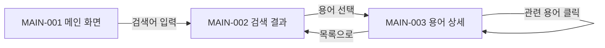
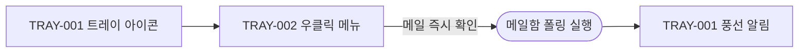
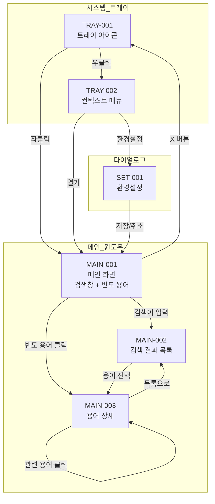

# 화면 정의 목록

## 개요

본 문서는 메일 수신 용어 해설 업무 지원 도구의 전체 화면 구조와 목록을 정의한다.

- **서비스 유형**: Windows 데스크톱 애플리케이션 (WinUI 3 / WPF)
- **플랫폼**: Windows 11 이상
- **기본 해상도**: 800 x 600 픽셀 (최소 640 x 480)
- **테마**: 시스템 설정에 따른 다크/라이트 모드 자동 전환
- **접근성**: 고DPI 스케일링 지원, Tab 키 전체 탐색 지원

### 화면 코드 체계

| 접두사 | 영역 | 설명 |
|--------|------|------|
| TRAY | 트레이 | 시스템 트레이 아이콘 및 컨텍스트 메뉴 |
| MAIN | 메인 뷰어 | 용어사전 뷰어 메인 윈도우 |
| SET | 환경설정 | 환경설정 다이얼로그 |

## 진행 상태 범례

- ✅ 정의 완료
- 🔄 검토 중
- 📋 정의 예정
- ⏸️ 보류

## 사용자 유형별 접근 화면 매트릭스

본 서비스는 로컬 데스크톱 앱으로, 별도의 사용자 인증/역할 구분이 없다. 앱을 실행한 로컬 사용자가 모든 화면에 접근 가능하다.

| 화면명 | 로컬 사용자 | 비고 |
|--------|-------------|------|
| 트레이 아이콘 | O | 앱 실행 시 항상 표시 |
| 트레이 컨텍스트 메뉴 | O | 트레이 아이콘 우클릭 |
| 용어사전 뷰어 메인 | O | 트레이 좌클릭 / 메뉴 "열기" |
| 검색 결과 목록 | O | 검색어 입력 시 |
| 용어 상세 | O | 검색 결과에서 용어 선택 |
| 환경설정 다이얼로그 | O | 트레이 메뉴 "환경설정" |

## 화면 목록

| 코드 | 화면명 | 경로/위치 | 설명 | 상태 |
|------|--------|-----------|------|------|
| TRAY-001 | 트레이 아이콘 | 시스템 트레이 영역 | 앱 상주 아이콘, 좌클릭/우클릭 동작 제공 | ✅ |
| TRAY-002 | 트레이 컨텍스트 메뉴 | 트레이 아이콘 우클릭 | 열기/환경설정/메일 즉시 확인/종료 메뉴 | ✅ |
| MAIN-001 | 용어사전 뷰어 메인 | 메인 윈도우 | 검색창 + 빈도 높은 용어 바로가기 + 상태 바 | ✅ |
| MAIN-002 | 검색 결과 목록 | 메인 윈도우 (검색 상태) | 검색어에 대한 용어 목록 표시 | ✅ |
| MAIN-003 | 용어 상세 | 메인 윈도우 (상세 상태) | 선택한 용어의 상세 해설 표시 | ✅ |
| SET-001 | 환경설정 다이얼로그 | 모달 다이얼로그 | 메일/수신/저장/분석 설정 관리 | ✅ |

## 사용자 여정 (User Journey)

### 여정 1: 앱 최초 실행 및 환경설정

### 여정 2: 메일 수신 후 용어 사전 확인

### 여정 3: 용어 검색

### 여정 4: 메일 즉시 확인 요청

### 여정 5: 앱 종료

## 전체 화면 네비게이션 맵

