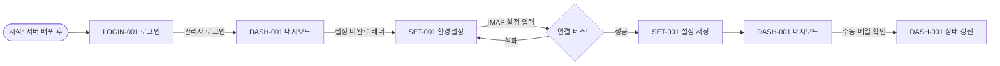
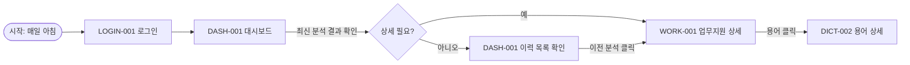
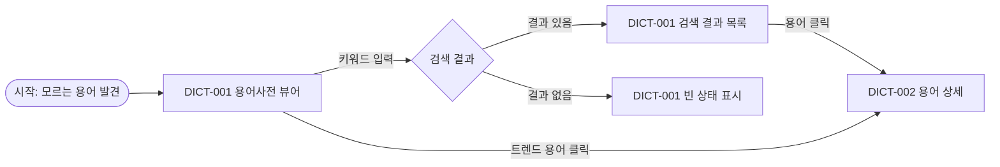
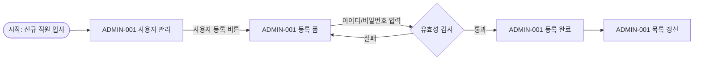
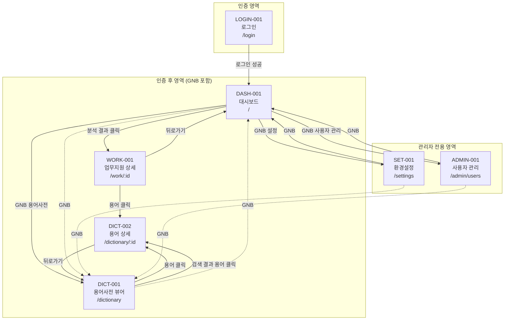

# 화면 정의 목록

## 개요

### 서비스 구조 요약
메일 수신 용어 해설 업무 지원 웹 서비스의 화면 정의를 관리한다. Next.js 15 App Router 기반의 반응형 웹 서비스로, 관리자와 일반 사용자가 메일 분석 결과 및 용어 사전을 조회할 수 있다.

### 플랫폼 및 해상도 기준
- **플랫폼**: 웹 브라우저 (Chrome 80+, Edge 80+, Firefox 78+, Safari 14+)
- **해상도**: 360px(모바일) ~ 1920px(데스크톱) 반응형
- **브레이크포인트**: Tailwind CSS 기본값 (sm:640, md:768, lg:1024, xl:1280)
- **기술 스택**: Next.js 15 App Router, Tailwind CSS, ES2016/CSS3

### 화면 코드 체계
- `LOGIN-xxx`: 인증 관련 화면
- `DASH-xxx`: 대시보드 화면
- `WORK-xxx`: 업무지원 화면
- `DICT-xxx`: 용어사전 화면
- `SET-xxx`: 환경설정 화면
- `ADMIN-xxx`: 관리자 전용 화면

### 라우팅 구조 (Next.js App Router)
```
app/
  login/page.tsx          # LOGIN-001
  (authenticated)/        # 인증 필요 레이아웃 그룹
    layout.tsx            # GNB 포함 공통 레이아웃
    page.tsx              # DASH-001 (/)
    work/
      [id]/page.tsx       # WORK-001
    dictionary/
      page.tsx            # DICT-001
      [id]/page.tsx       # DICT-002
    settings/page.tsx     # SET-001
    admin/
      users/page.tsx      # ADMIN-001
  api/                    # API Route Handlers
  middleware.ts           # 인증 미들웨어
```

## 진행 상태 범례
- ✅ 정의 완료
- 🔄 검토 중
- 📋 정의 예정
- ⏸️ 보류

## 사용자 유형별 접근 화면 매트릭스

| 화면명 | 코드 | 비로그인 | 일반 사용자 (user) | 관리자 (admin) |
|--------|------|----------|-------------------|----------------|
| 로그인 | LOGIN-001 | ✅ 접근 가능 | 리다이렉트 (/) | 리다이렉트 (/) |
| 대시보드 | DASH-001 | 리다이렉트 (/login) | ✅ 조회 | ✅ 조회 + 수동 실행 |
| 업무지원 상세 | WORK-001 | 리다이렉트 (/login) | ✅ 조회 | ✅ 조회 |
| 용어사전 뷰어 | DICT-001 | 리다이렉트 (/login) | ✅ 검색/조회 | ✅ 검색/조회 |
| 용어 상세 | DICT-002 | 리다이렉트 (/login) | ✅ 조회 | ✅ 조회 |
| 환경설정 | SET-001 | 리다이렉트 (/login) | 접근 불가 (403) | ✅ 조회/수정 |
| 사용자 관리 | ADMIN-001 | 리다이렉트 (/login) | 접근 불가 (403) | ✅ 조회/등록/삭제 |

## 화면 목록

| 코드 | 화면명 | 라우트 | 설명 | 접근 권한 | 상태 |
|------|--------|--------|------|-----------|------|
| LOGIN-001 | 로그인 | `/login` | 아이디/비밀번호 입력으로 세션 인증 | 비로그인 전용 | ✅ |
| DASH-001 | 대시보드 | `/` | 서비스 상태 + 최신 분석 결과 + 최근 이력 | 로그인 필요 (all) | ✅ |
| WORK-001 | 업무지원 상세 | `/work/:id` | 개별 메일 분석 상세 (요약, 후속 작업, 추출 용어) | 로그인 필요 (all) | ✅ |
| DICT-001 | 용어사전 뷰어 | `/dictionary` | 용어 검색 + 빈도 트렌드 바로가기 | 로그인 필요 (all) | ✅ |
| DICT-002 | 용어 상세 | `/dictionary/:id` | 용어 해설 전문 + 출처 메일 목록 | 로그인 필요 (all) | ✅ |
| SET-001 | 환경설정 | `/settings` | IMAP/분석 설정 조회 및 수정 | 관리자 전용 | ✅ |
| ADMIN-001 | 사용자 관리 | `/admin/users` | 사용자 계정 목록 조회, 등록, 삭제 | 관리자 전용 | ✅ |

## 사용자 여정 (User Journey)

### 여정 1: 최초 설정 (관리자)



### 여정 2: 일상 업무 확인 (일반 사용자)



### 여정 3: 용어 검색 (일반 사용자)



### 여정 4: 사용자 관리 (관리자)



## 전체 화면 네비게이션 맵



## 공통 레이아웃

### GNB (Global Navigation Bar)
인증 후 모든 화면에서 상단에 표시되는 공통 네비게이션이다.

| 컴포넌트 | 표시 조건 | 설명 |
|----------|-----------|------|
| 서비스 로고/제목 | 항상 | 클릭 시 대시보드(/)로 이동 |
| 대시보드 링크 | 항상 | 현재 활성 화면 하이라이트 |
| 용어사전 링크 | 항상 | `/dictionary`로 이동 |
| 환경설정 링크 | admin만 | `/settings`로 이동 (POL-UI 예외 사항) |
| 사용자 관리 링크 | admin만 | `/admin/users`로 이동 (POL-UI 예외 사항) |
| 사용자 정보 | 항상 | 현재 로그인 사용자명 및 역할 표시 |
| 로그아웃 버튼 | 항상 | 세션 삭제 후 로그인 화면으로 이동 |

**모바일 반응형**: md(768px) 미만에서는 햄버거 메뉴로 전환한다.

### 토스트 알림 영역
화면 우상단에 표시되는 토스트 메시지 영역이다 (POL-UI UI-R-020).
- 성공: 녹색 배경, 3초 후 자동 사라짐
- 오류: 빨간색 배경, 3초 후 자동 사라짐
- 정보: 파란색 배경, 3초 후 자동 사라짐
