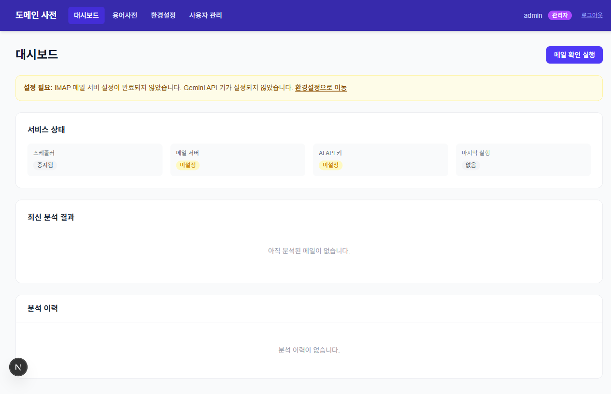
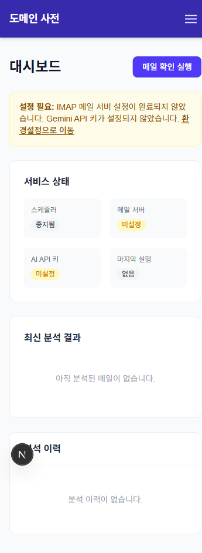

# Sprint 4 Playwright 검증 보고서

- **검증 일자**: 2026-03-15
- **검증 환경**: http://localhost:3000 (npm run dev)
- **브랜치**: sprint4

---

## 검증 결과 요약

| 시나리오 | 결과 | 비고 |
|----------|------|------|
| 앱 접근 및 로그인 리다이렉트 | ✅ 통과 | `/` 접근 시 `/login`으로 리다이렉트 |
| 로그인 API 동작 | ✅ 통과 | `POST /api/auth/login` 200 응답 |
| 대시보드 렌더링 | ✅ 통과 | 서비스 상태 카드, 배너, 빈 상태 정상 표시 |
| 서비스 상태 API | ✅ 통과 | `GET /api/mail/status` 200 응답 |
| 최신 분석 결과 API | ✅ 통과 | `GET /api/analysis/latest` 200 응답, 빈 상태 표시 |
| 분석 이력 API | ✅ 통과 | `GET /api/analysis/history` 200 응답, 빈 상태 표시 |
| 설정 미완료 경고 배너 | ✅ 통과 | IMAP 미설정, API 키 미설정 배너 표시 |
| 수동 메일 확인 API | ✅ 통과 | `POST /api/mail/check` 200 응답 |
| admin 전용 버튼 표시 | ✅ 통과 | admin 계정 로그인 시 버튼 표시 확인 |
| 모바일 반응형 (360px) | ✅ 통과 | 카드 2열 그리드, 햄버거 메뉴 정상 |
| 콘솔 오류 | ✅ 통과 | 에러 0건 |

---

## 상세 시나리오별 결과

### 1. 대시보드 렌더링 검증

- `GET /` 접근 시 `/login`으로 리다이렉트 확인
- `admin / Admin123!`으로 로그인 후 `/dashboard` 진입
- 4개 API 병렬 호출 확인:
  - `GET /api/mail/status` — 200 OK
  - `GET /api/analysis/latest` — 200 OK
  - `GET /api/analysis/history?page=1` — 200 OK
  - `GET /api/auth/me` — 200 OK
- **서비스 상태 카드**: 스케줄러(중지됨), 메일 서버(미설정), AI API 키(미설정), 마지막 실행(없음) 정상 표시
- **경고 배너**: "IMAP 메일 서버 설정이 완료되지 않았습니다. Gemini API 키가 설정되지 않았습니다." + "환경설정으로 이동" 링크 표시
- **최신 분석 결과**: "아직 분석된 메일이 없습니다." 빈 상태 정상 표시
- **분석 이력**: "분석 이력이 없습니다." 빈 상태 정상 표시

### 2. 수동 메일 확인 API 검증

- `POST /api/mail/check` 직접 호출 — 200 응답, `{ success: true, message: "메일 확인이 시작되었습니다." }` 확인
- **참고**: Playwright 환경에서 `window.confirm`이 자동 dismiss되어 버튼 클릭 → 토스트 표시 흐름은 자동 검증 불가. 수동 검증 필요 항목으로 기록.

### 3. 모바일 반응형 검증 (360px)

- GNB 햄버거 메뉴 아이콘 표시 확인
- 서비스 상태 카드 2열 그리드(sm:grid-cols-4 → grid-cols-2) 정상 전환
- 경고 배너 텍스트 줄바꿈 정상
- 모든 섹션 수직 배치 정상

---

## 자동 검증 불가 항목 (수동 필요)

| 항목 | 사유 |
|------|------|
| 버튼 클릭 → confirm 다이얼로그 → 토스트 표시 | Playwright가 `window.confirm`을 자동 dismiss |
| user role 계정으로 버튼 숨김 확인 | DB에 활성 user 계정 없음 |
| 409 중복 실행 응답 확인 | 수동으로 빠르게 연속 클릭 필요 |

---

## 특이사항

- 검증 환경의 관리자 계정: `admin / Admin123!` (`.env.local` 기준)
- `MAIL_PASSWORD`, `GEMINI_API_KEY` 미설정 상태 — 서비스 상태 카드의 "미설정" 배너가 정상 표시됨
- 스케줄러는 Sprint 5 구현 전까지 항상 "중지됨" 상태 — 설계대로 동작
